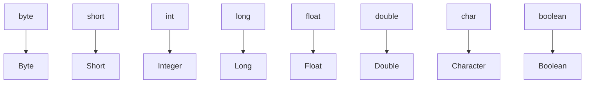

# Java常用类--包装类

- 对于基本数据类型而言，它其实就是一个数，如果给基本数据类型加点属性，加点方法，加点构造器之后，这个基本数据类型就对应的完成了封装，产生了一个新的类，这个类就是包装类
- 包装类是引用数据类型
- 基本数据类型对应的包装类



- 包装类的继承关系
  - Byte---->Number---->Object
  - Short---->Number---->Object
  - Integer---->Number---->Object
  - Long---->Number---->Object
  - Float---->Number---->Object
  - Double---->Number---->Object
  - Character---->Object
  - Boolean---->Object

- 为什么要使用包装类
  - Java语言是面向对象的语言，擅长操作各种类，通过类可以实现更多更高级的功能
  - 由于集合只能使用引用数据类型，所以引用类方便使用集合
- 包装类的方法有很多，具体查看API文档

## 包装类的自动装箱与自动拆箱

- 自动装箱与自动拆箱其实就是数据类型之间的自动转变
- 自动装箱就是基础数据类型自动转为包装类
- 自动拆箱就是包装类自动转为基础数据类型

```java
public class Test03 {
    // 这是main方法，是实现程序主要逻辑
    public static void main(String[] args) {
        // int --->Integer
        // 自动装箱
        Integer i = 12;
        System.out.println(i);

        // 自动拆箱
        // Integer -->int
        Integer i2 = new Integer(23);
        int num2 = i2;
        System.out.println(num2);
    }
}
```

- 自动装箱与自动拆箱只是一个快速的写法，使用反编译工具最后解析class文件发现其实还是使用了方法进行转换；

```java
package com.shanlei;

import java.io.PrintStream;

public class Test03
{
  public static void main(String[] args)
  {
    Integer i = Integer.valueOf(12);
    System.out.println(i);

    Integer i2 = new Integer(23);
    int num2 = i2.intValue();
    System.out.println(num2);
  }
}
```


