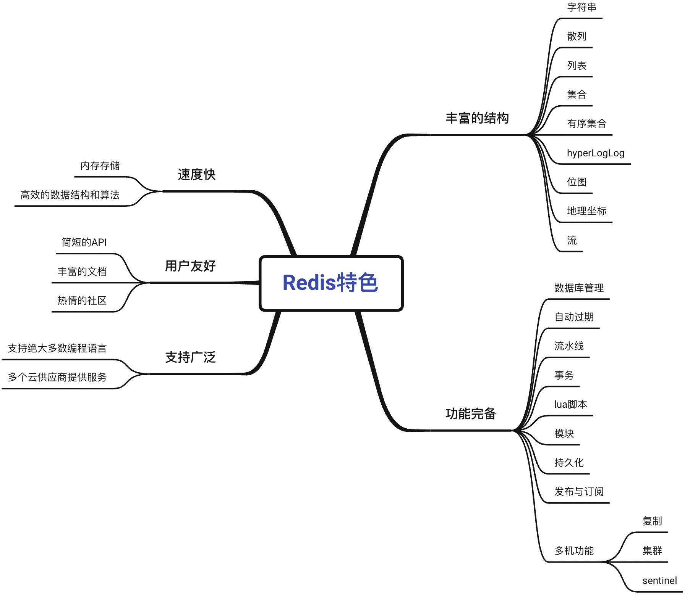

# Redis

**详细内容参考以下章节**

|                  章节                   | 简介                                           |
| :-------------------------------------: | ---------------------------------------------- |
| [安装与配置](/Redis/redis安装与配置.md) | 主要介绍redis的安装与配置,以及服务器中相关设置 |
|                                         |                                                |
|                                         |                                                |
|                                         |                                                |

- Redis是一个主要由Salvatore Sanfilippo（Antirez）开发的开源内存数据结构存储器，经常用作数据库、缓存以及消息代理等。

- Redis之所以广受开发者欢迎，跟它自身拥有强大的功能以及简洁的设计不无关系。

## 结构丰富

Redis为用户提供了字符串、散列、列表、集合、有序集合、HyperLogLog、位图、流、地理坐标等一系列丰富的数据结构，每种数据结构都适用于解决特定的问题。在有需要的时候，用户还可以通过事务、Lua脚本、模块等特性，扩展已有数据结构的功能，甚至从零实现自己专属的数据结构。通过这些数据结构和特性，Redis能够确保用户可以使用适合的工具去解决问题。

## 功能完备

Redis提供了很多非常实用的附加功能，比如自动过期、流水线、事务、数据持久化等，这些功能能够帮助用户将Redis应用在更多不同的场景中，或者为用户带来便利。更重要的是，Redis不仅可以单机使用，还可以多机使用：通过Redis自带的复制、Sentinel和集群功能，用户可以将自己的数据库扩展至任意大小。

## 速度飞快

Redis是一款内存数据库，它将所有数据存储在内存中。因为计算机访问内存的速度要远远高于访问硬盘的速度，所以与基于硬盘设计的传统数据库相比，Redis在数据的存取速度方面具有天然的优势。但Redis并没有因此放弃在效率方面的追求，相反，Redis的开发者在实现各项数据结构和特性的时候都经过了大量考量，在底层选用了很多非常高效的数据结构和算法，以此来确保每个操作都可以在尽可能短的时间内完成，并且尽可能地节省内存。

## 用户友好

虽然Redis提供了很多很棒的数据结构和特性，但如果它们使用起来非常困难的话，那么这一切就没有意义。Redis API遵循的是UNIX一次只做一件事，并把它做好的设计哲学。

Redis的API虽然丰富，但它们大部分都非常简短，并且只需接受几个参数就可以完成用户指定的操作。

更棒的是，Redis在官方网站（[redis.io](https://redis.io/)）上为每个API以及相关特性都提供了详尽的文档，并且客户端本身也可以在线查询这些文档。

## 支持广泛

Redis已经在互联网公司得到广泛应用，许多开发者为不同的编程语言开发了相应的客户端（redis.io/clients），大多数编程语言的使用者都可以轻而易举地找到所需的客户端，然后直接开始使用Redis。此外，包括亚马逊、谷歌、RedisLabs、阿里云和腾讯云在内的多个云服务提供商都提供了基于Redis或兼容Redis的服务，如果你不打算自己搭建Redis服务器，那么上述提供商可能是不错的选择。

