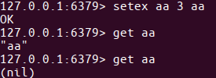
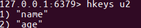
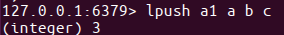
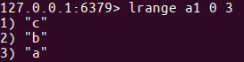
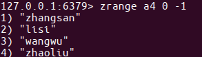
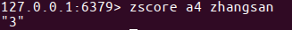
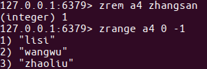
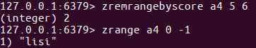

# Redis数据库

 Redis 是一个高性能的key-value数据库。 

## 安装

- 下载

从Redis官网下载

` http://www.redis.cn/ `

也可以在终端中使用命令进行下载

>  `wget http://download.redis.io/releases/redis-5.0.5.tar.gz `

- step2:解压

  > tar -zxvf redis-3.2.8.tar.gz

- step3:复制，放到usr/local⽬录下

  > sudo mv ./redis-3.2.8 /usr/local/redis/

- step4:进⼊redis⽬录

  > cd /usr/local/redis/

- step5:生成

  > sudo make

- step6:测试,这段运⾏时间会较⻓

  > sudo make test

  - 如果test发生错误`You need tcl 8.5or newer in order to run the Redis test`
    - 下载tcl:
    - ` https://sourceforge.net/projects/tcl/ `
    - 解压tcl
    - 将解压后的tcl文件移动到`/usr/local`目录下
    - cd 到`/usr/local/tcl8.6.1/unix/`目录下
    - 执行命令`sudo  ./configure`
    - 安装tcl`sudo make install`

- step7:安装,将redis的命令安装到/usr/local/bin/⽬录

  > sudo make install

- step8:安装完成后，我们进入目录/usr/local/bin中查看

  > cd /usr/local/bin
  > ls -all

  

  > - redis-server redis服务器
  > - redis-cli redis命令行客户端
  > - redis-benchmark redis性能测试工具
  > - redis-check-aof AOF文件修复工具
  > - redis-check-rdb RDB文件检索工具

- step9:配置⽂件，移动到/etc/⽬录下

- 配置⽂件⽬录为/usr/local/redis/redis.conf

  > sudo cp /usr/local/redis/redis.conf 

## 配置

- Redis的配置信息在/etc/redis/redis.conf下。

- 查看

  > sudo vi /etc/redis/redis.conf

- 绑定ip：如果需要远程访问，可将此⾏注释，或绑定⼀个真实ip

  > bind 127.0.0.1

- 端⼝，默认为6379

  > port 6379

- 是否以守护进程运⾏

  - 如果以守护进程运⾏，则不会在命令⾏阻塞，类似于服务
  - 如果以⾮守护进程运⾏，则当前终端被阻塞
  - 设置为yes表示守护进程，设置为no表示⾮守护进程
  - 推荐设置为yes

  > daemonize yes

- 数据⽂件

  > dbfilename dump.rdb

- 数据⽂件存储路径

  > dir /var/lib/redis

- ⽇志⽂件

  > logfile /var/log/redis/redis-server.log

- 数据库，默认有16个

  > database 16

- 主从复制，类似于双机备份。

  > slaveof

## 服务端和客户端命令

- 服务器端的命令为redis-server

- 可以使⽤help查看帮助⽂档

  > redis-server --help

- 推荐使⽤服务的⽅式管理redis服务

- 启动

  > sudo service redis start

- 停⽌

  > sudo service redis stop

- 重启 sudo service redis restart

- 个人习惯

  > ps -ef|grep redis 查看redis服务器进程
  > sudo kill -9 pid 杀死redis服务器 pid是进程id
  >
  > sudo redis-server /usr/local/redis/redis.conf 指定加载的配置文件

## 客户端

- 客户端的命令为redis-cli

- 可以使⽤help查看帮助⽂档

  > redis-cli --help

- 连接redis

  > redis-cli

- 运⾏测试命令

  > ping

- 切换数据库

- 数据库没有名称，默认有16个，通过0-15来标识，连接redis默认选择第一个数据库

  > select n


## 数据操作

- redis是key-value的数据结构，每条数据都是⼀个键值对

- 键的类型是字符串

- 注意：键不能重复

  

- 值的类型分为五种：

  - 字符串string
  - 哈希hash
  - 列表list
  - 集合set
  - 有序集合zset

## 数据操作行为

- 保存
- 修改
- 获取
- 删除

点击中⽂官⽹查看命令⽂档http://redis.cn/commands.html

### 1.string

- string类型
  - 字符串类型是Redis中最为基础的数据存储类型，它在Redis中是二进制安全的，这便意味着该类型可以接受任何格式的数据，如JPEG图像数据或Json对象描述信息等。在Redis中字符串类型的Value最多可以容纳的数据长度是512M。

#### 保存

如果设置的键不存在则为添加，如果设置的键已经存在则修改

- 设置键值

  > set key value

- 例1：设置键为name值为itcast的数据

  > set name itcast

  

- 设置键值及过期时间，以秒为单位

  > setex key seconds value

- 例2：设置键为aa值为aa过期时间为3秒的数据

  > setex aa 3 aa

  

- 设置多个键值

  > mset key1 value1 key2 value2 ...

- 例3：设置键为'a1'值为'python'、键为'a2'值为'java'、键为'a3'值为'c'

  > mset a1 python a2 java a3 c

  

- 追加值

  > append key value

- 例4：向键为a1中追加值' haha'

  > append 'a1' 'haha'

  

#### 获取

- 获取：根据键获取值，如果不存在此键则返回nil

  > get key

- 例5：获取键'name'的值

  > get 'name'

- 根据多个键获取多个值

  > mget key1 key2 ...

- 例6：获取键a1、a2、a3'的值

  > mget a1 a2 a3

  

#### 删除

详⻅下节键的操作，删除键时会将值删除


### 2. 键命令

- 查找键，参数⽀持正则表达式

  > keys pattern

- 例1：查看所有键

  > keys *

  

- 例2：查看名称中包含a的键

  > keys 'a*'

  

- 判断键是否存在，如果存在返回1，不存在返回0

  > exists key1

- 例3：判断键a1是否存在

  > exists a1

  

- 查看键对应的value的类型

  > type key

- 例4：查看键a1的值类型，为redis⽀持的五种类型中的⼀种

  > type a1

  

- 删除键及对应的值

  > del key1 key2 ...

- 例5：删除键a2、a3

  > del a2 a3

  

- 设置过期时间，以秒为单位

- 如果没有指定过期时间则⼀直存在，直到使⽤DEL移除

  > expire key seconds

- 例6：设置键'a1'的过期时间为3秒

  > expire 'a1' 3

  

- 查看有效时间，以秒为单位

  > ttl key

- 例7：查看键'bb'的有效时间

  > ttl bb

  

### 3. hash

- hash⽤于存储对象，对象的结构为属性、值
- 值的类型为string

#### 增加、修改

- 设置单个属性

  > hset key field value

- 例1：设置键 user的属性name为itheima

  > hset user name itheima

  

MISCONF Redis is configured to save RDB snapshots, but is currently not able to persist on disk. Commands that may modify the data set are disabled. Please check Redis logs for details about the error.

Redis被配置为保存数据库快照，但它目前不能持久化到硬盘。用来修改集合数据的命令不能用

原因：

- 强制关闭Redis快照导致不能持久化。 解决方案：

- 运行config set stop-writes-on-bgsave-error no　命令后，关闭配置项stop-writes-on-bgsave-error解决该问题。

- 设置多个属性

  > hmset key field1 value1 field2 value2 ...

- 例2：设置键u2的属性name为itcast、属性age为11

  > hmset u2 name itcast age 11

  

#### 获取

- 获取指定键所有的属性

  > hkeys key

- 例3：获取键u2的所有属性

  > hkeys u2

  

- 获取⼀个属性的值

  > hget key field

- 例4：获取键u2属性'name'的值

  > hget u2 'name'

  

- 获取多个属性的值

  > hmget key field1 field2 ...

- 例5：获取键u2属性'name'、'age的值

  > hmget u2 name age

  

- 获取所有属性的值

  > hvals key

- 例6：获取键'u2'所有属性的值

  > hvals u2

  

#### 删除

- 删除整个hash键及值，使⽤del命令

- 删除属性，属性对应的值会被⼀起删除

  > hdel key field1 field2 ...

- 例7：删除键'u2'的属性'age'

  > hdel u2 age

  

### 4.list

- 列表的元素类型为string
- 按照插⼊顺序排序

#### 增加

- 在左侧插⼊数据

  > lpush key value1 value2 ...

- 例1：从键为'a1'的列表左侧加⼊数据a 、 b 、c

  > lpush a1 a b c

  

  

- 在右侧插⼊数据

  > rpush key value1 value2 ...

- 例2：从键为'a1'的列表右侧加⼊数据0 1

  > rpush a1 0 1

  

  

- 在指定元素的前或后插⼊新元素

  > linsert key before或after 现有元素 新元素

- 例3：在键为'a1'的列表中元素'b'前加⼊'3'

  > linsert a1 before b 3

  

#### 获取

- 返回列表⾥指定范围内的元素

  - start、stop为元素的下标索引
  - 索引从左侧开始，第⼀个元素为0
  - 索引可以是负数，表示从尾部开始计数，如-1表示最后⼀个元素

  > lrange key start stop

- 例4：获取键为'a1'的列表所有元素

  > lrange a1 0 -1

  

#### 设置指定索引位置的元素值

- 索引从左侧开始，第⼀个元素为0

- 索引可以是负数，表示尾部开始计数，如-1表示最后⼀个元素

  > lset key index value

- 例5：修改键为'a1'的列表中下标为1的元素值为'z'

  > lset a 1 z

  

#### 删除

- 删除指定元素

  - 将列表中前count次出现的值为value的元素移除
  - count > 0: 从头往尾移除
  - count < 0: 从尾往头移除
  - count = 0: 移除所有

  > lrem key count value

- 例6.1：向列表'a2'中加⼊元素'a'、'b'、'a'、'b'、'a'、'b'

  > lpush a2 a b a b a b

  

- 例6.2：从'a2'列表右侧开始删除2个'b'

  > lrem a2 -2 b

- 例6.3：查看列表'py12'的所有元素

  > lrange a2 0 -1

  

### 5.set

- ⽆序集合
- 元素为string类型
- 元素具有唯⼀性，不重复
- 说明：对于集合没有修改操作

#### 增加

- 添加元素

  > sadd key member1 member2 ...

- 例1：向键'a3'的集合中添加元素'zhangsan'、'lisi'、'wangwu'

  > sadd a3 zhangsan sili wangwu

  

#### 获取

- 返回所有的元素

  > smembers key

- 例2：获取键'a3'的集合中所有元素

  > smembers a3

  

#### 删除

- 删除指定元素

  > srem key

- 例3：删除键'a3'的集合中元素'wangwu'

  > srem a3 wangwu

  

### 6.zset

- sorted set，有序集合
- 元素为string类型
- 元素具有唯⼀性，不重复
- 每个元素都会关联⼀个double类型的score，表示权重，通过权重将元素从⼩到⼤排序
- 说明：没有修改操作

#### 增加

- 添加

  > zadd key score1 member1 score2 member2 ...

- 例1：向键'a4'的集合中添加元素'lisi'、'wangwu'、'zhaoliu'、'zhangsan'，权重分别为4、5、6、3

  > zadd a4 4 lisi 5 wangwu 6 zhaoliu 3 zhangsan

#### 获取

- 返回指定范围内的元素

- start、stop为元素的下标索引

- 索引从左侧开始，第⼀个元素为0

- 索引可以是负数，表示从尾部开始计数，如-1表示最后⼀个元素

  > zrange key start stop

- 例2：获取键'a4'的集合中所有元素

  > zrange a4 0 -1

  

- 返回score值在min和max之间的成员

  > zrangebyscore key min max

- 例3：获取键'a4'的集合中权限值在5和6之间的成员

  > zrangebyscore a4 5 6

  

- 返回成员member的score值

  > zscore key member

- 例4：获取键'a4'的集合中元素'zhangsan'的权重

  > zscore a4 zhangsan

  

#### 删除

- 删除指定元素

  > zrem key member1 member2 ...

- 例5：删除集合'a4'中元素'zhangsan'

  > zrem a4 zhangsan

  

- 删除权重在指定范围的元素

  > zremrangebyscore key min max

- 例6：删除集合'a4'中权限在5、6之间的元素

  > zremrangebyscore a4 5 6

  

## 与python交互

#### 安装包

安装Redis的有3种方式https://github.com/andymccurdy/redis-py

- 第一种：进⼊虚拟环境py_django，联⽹安装包redis

  > pip install redis

- 第二种：进⼊虚拟环境py_django，联⽹安装包redis

  > easy_install redis

- 第三种：到中⽂官⽹-客户端下载redis包的源码，使⽤源码安装

  > 一步步执行 wget https://github.com/andymccurdy/redis-py/archive/master.zip
  > unzip master.zip
  > cd redis-py-master
  > sudo python setup.py install

#### 调⽤模块

- 引⼊模块

  > from redis import *

- 这个模块中提供了StrictRedis对象(Strict严格)，⽤于连接redis服务器，并按照不同类型提供 了不同⽅法，进⾏交互操作

#### StrictRedis对象⽅法

- 通过init创建对象，指定参数host、port与指定的服务器和端⼝连接，host默认为localhost，port默认为6379，db默认为0

```
sr = StrictRedis(host='localhost', port=6379, db=0)

简写
sr=StrictRedis()
```

- 根据不同的类型，拥有不同的实例⽅法可以调⽤，与前⾯学的redis命令对应，⽅法需要的参数与命令的参数⼀致

##### string

- set
- setex
- mset
- append
- get
- mget
- key

##### keys

- exists
- type
- delete
- expire
- getrange
- ttl

##### hash

- hset
- hmset
- hkeys
- hget
- hmget
- hvals
- hdel

##### list

- lpush
- rpush
- linsert
- lrange
- lset
- lrem

##### set

- sadd
- smembers
- srem

##### zset

- zadd
- zrange
- zrangebyscore
- zscore
- zrem
- zremrangebyscore


#### String操作

- 在桌面上创建redis目录
- 使用pycharm打开 redis目录
- 创建redis_string.py文件

```python
from redis import *
if __name__=="__main__":
    try:
        #创建StrictRedis对象，与redis服务器建⽴连接
        sr=StrictRedis()

    except Exception as e:
        print(e)
```

##### string-增加

- ⽅法set，添加键、值，如果添加成功则返回True，如果添加失败则返回False
- 编写代码如下

```python
from redis import *
if __name__=="__main__":
    try:
        #创建StrictRedis对象，与redis服务器建⽴连接
        sr=StrictRedis()
        #添加键name，值为itheima
        result=sr.set('name','itheima')
        #输出响应结果，如果添加成功则返回True，否则返回False
        print(result)
    except Exception as e:
        print(e)
```

##### string-获取

- ⽅法get，添加键对应的值，如果键存在则返回对应的值，如果键不存在则返回None
- 编写代码如下

```python
from redis import *
if __name__=="__main__":
    try:
        #创建StrictRedis对象，与redis服务器建⽴连接
        sr=StrictRedis()
        #获取键name的值
        result = sr.get('name')
        #输出键的值，如果键不存在则返回None
        print(result)
    except Exception as e:
        print(e)
```

##### string-修改

- ⽅法set，如果键已经存在则进⾏修改，如果键不存在则进⾏添加
- 编写代码如下

```python
from redis import *
if __name__=="__main__":
    try:
        #创建StrictRedis对象，与redis服务器建⽴连接
        sr=StrictRedis()
        #设置键name的值，如果键已经存在则进⾏修改，如果键不存在则进⾏添加
        result = sr.set('name','itcast')
        #输出响应结果，如果操作成功则返回True，否则返回False
        print(result)
    except Exception as e:
        print(e)
```

##### string-删除

- ⽅法delete，删除键及对应的值，如果删除成功则返回受影响的键数，否则则返 回0
- 编写代码如下

```python
from redis import *
if __name__=="__main__":
    try:
        #创建StrictRedis对象，与redis服务器建⽴连接
        sr=StrictRedis()
        #设置键name的值，如果键已经存在则进⾏修改，如果键不存在则进⾏添加
        result = sr.delete('name')
        #输出响应结果，如果删除成功则返回受影响的键数，否则则返回0
        print(result)
    except Exception as e:
        print(e)
```

##### 获取键

- ⽅法keys，根据正则表达式获取键
- 编写代码如下

```python
from redis import *
if __name__=="__main__":
    try:
        #创建StrictRedis对象，与redis服务器建⽴连接
        sr=StrictRedis()
        #获取所有的键
        result=sr.keys()
        #输出响应结果，所有的键构成⼀个列表，如果没有键则返回空列表
        print(result)
    except Exception as e:
        print(e)
```

## 搭建主从

