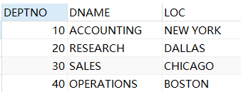
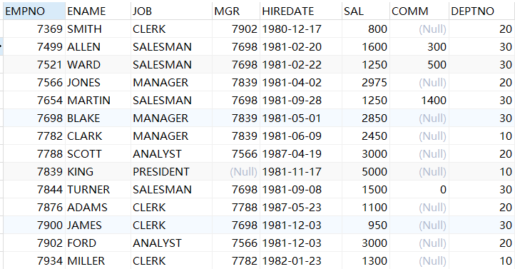
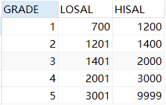

# 数据查询语言（Data Query Language，DQL）-单表查询

- 单表查询也就是在一张表里面进行查询
- select语句的结构顺序是固定的,不可以改变顺序

```mysql
select column, group_function(column) 
from table 
[where condition] 
[group by  group_by_expression] 
[having group_condition] 
[order by column]
[limit]; 
```

- 为了练习SQL语句,准备emp、dept、salgrade与bonus四张表
- dept是部门表，部门表：dept:department 部分 ，loc - location 位置



- emp是员工表：emp:employee 员工   ,mgr :manager上级领导编号，hiredate 入职日期  firedate 解雇日期 ，common：补助



- salgrade 是薪资等级表



- bonus 奖金表，奖金表不需要使用，所以是准备的空表

## 基础select语句

```mysql
-- 对员工表进行查询
select * from emp; -- * 代表所有数据

-- 部分列查询
select empno, ename, sal from emp;

-- 显示部分行 where 子句
select * from emp where sal>2000;
select empno, ename, job, mgr from emp where sal>2000;

-- 起别名
select empno 员工编号, ename 姓名, sal 工资 from emp;
select empno as 员工编号, ename s 姓名, sal as工资 from emp; -- 也可以使用as关键字  as是alias(别名)的缩写
select empno as '员工编号', ename s "姓名", sal as'工资' from emp; -- 别名中有特殊符号的时候,单引号(')或双引号(")不能省略不写

-- 算符运算符
select empno,ename,sal,sal+1000 as '涨薪后',deptno from emp where sal <2500;
select empno, ename, sal, comm, sal+comm from emp; -- 有空值的字段与其他字段运算之后,结果为空

-- 去重操作
select distinct job from emp;
-- 组合去重 
select distinct job, deptno from emp;

-- 排序
select * from emp order by sal; -- order by 默认升序排列
select * from emp order by sal asc; --  asc 升序,默认可以不写
select * from emp order by sal desc; --  desc 降序,指定排序方式
-- 组合排序
select * from emp order by sal asc, deptno desc; -- 在工资升序的基础下,deptbo按照降序排列

```

## where子句

```mysql
-- where子句,将过滤条件放在where子句的后面,可以筛选\过滤出我们想要的条件的数据
select * from emp where deptno = 10;
select * from emp where deptno > 10;
select * from emp where deptno >= 10;
select * from emp where deptno < 10;
select * from emp where deptno <= 10;
select * from emp where deptno <> 10;
select * from emp where deptno != 10;
select * from emp where job = 'CLERK'; -- 默认情况下 字符串不区分大小写
select * from emp where job = 'clerk'; 
-- 区分大小写查询
select * from emp where binary job = 'clerk'; -- 添加了binary之后,指明区分大小写

select * from emp where hiredate < "1981-12-25";

-- where子句 + 逻辑运算符:and
select * from emp where sal > 1500 and sal < 3000 order by sal;
select * from emp where sal > 1500 && sal < 3000 order by sal; -- 中间条件使用and与&& 效果都一样,
select * from emp where sal between 1500 and 3000 order by sal; -- 使用between的时候,左右都是包含的

-- where子句 + 逻辑运算符:or
select * from emp where deptno =10 or deptno =20;
select * from emp where deptno =10 || deptno =20;
select * from emp where deptno in(10,20);
select * from emp where job in ("MANAGER","CLERK","ANALYST");

-- where子句 + 模糊查询 
-- 查询名字带A的员工  "%" 代表任意多个字符
select * from emp  where  ename like "%a%";
-- 查询名字第二个字母是A的 "_" 代表一个任意字符
select * from emp  where  ename like "_a%";

-- where子句 + null的判断
select * from emp where comm is null;
select * from emp where comm is not null;
 
-- where子句 + 小括号的使用 不同运算符的优先级不同,加括号可以指定优先级
select * from emp where job = "salesman" or job = 'clerk' and sal > 1500; -- 先 and 再 or   and优先级大于or
select * from emp where job = "salesman" or (job = 'clerk' and sal > 1500); -- 小括号内的优先级最高,加了小括号的优先运行
select * from emp where (job = "salesman" or job = 'clerk') and sal > 1500;
```

## 函数（只列举常用的函数，函数详情可查阅API）

```mysql
-- 函数
select empno, ename, lower(ename), upper(ename), sal from emp;
-- 函数的功能,就是封装的一些特殊功能,直接使用完成某些功能
-- 函数的作用是为了提升select的能力
-- 函数没有改变字段或数据自身的值,而是在查询出来的结果上面进行加工,从而展示出不同的效果

select max(sal), min(sal), count(sal), sum(sal),avg(sal) from emp;
-- lower(ename), upper(ename)改变每一条结果,每一条数据都会对应进行修改
-- max(sal), min(sal), count(sal), sum(sal),avg(sal) 多条数据,最终展示一个结果
/*
函数的分类
  单行函数: 对每一条记录进行计算,并得到相应的计算结果,然后返回给用户
	多行函数: 对一组数据进行运算,针对这一组数据只返回一个结果,也称为分组函数
	除了多行函数(max, min, count, sum,avg),都是单行函数
*/

-- 单行函数语句
-- 字符串函数
select ename,length(ename), substring(ename,2,3) from emp;
-- substring 字符串截取,从字符下标为2开始,截取两位,(这里下标是从1开始的)

-- 数值函数
select abs(-5),ceil(5.3),floor(5.9),round(3.14) from dual; -- dual实际上是一个伪表,实际上不存在,
select abs(-5) 绝对值,ceil(5.3) 向上取整,floor(5.9) 向下取整,round(3.14) 四舍五入 -- 如果没有where条件的话,伪表查询的时候,from dual可以不写
select ceil(sal) from emp;
select mod(sal, 3) from emp; -- 对sal的值进行取模操作

-- 日期与时间函数
select * from emp;
select curdate(), curtime();
-- curdate() 年月日
-- curtime() 时分秒
select now(), sysdate(),sleep(3),now(), sysdate() from dual;
-- now() 年月日时分秒 当前语句执行的时间, 
-- sysdate() 年月日时分秒 当前函数执行的时间
-- 虽然可以表示年月日时分秒,但是插入数据的时候,还是要参照表的结构
insert into emp values(9999,'lili','SALASMAN',7698,NOW(),1000,NULL,30);
select * from emp;

-- 流程函数
select empno,ename,sal,if(sal>=2500,"高薪","低薪") as "薪资水平" from emp; -- if else 双分支结构
select empno,ename,sal,comm,sal+ifnull(comm,0) from emp; -- 如果comm是空的话,那么取0
select nullif(1,1),nullif(1,2) from dual; -- nullif   如果value1等于value2,返回null,否则,返回value1
-- case相关
-- case 等值判断
select empno, ename, job,
case job
when "CLERK" then "店员"
when "SALESMAN" then "销售"
when "MANAGER" then "经理"
else "其他"
end as "岗位",
sal from emp;
-- case 区间判断
select empno,ename,sal,
case
when sal<=1000 then "A"
when sal<=2000 then "B"
when sal<=3000 then "C"
else "D"
end as "工资等级",
deptno from emp;

-- JSON函数,JSON函数后续补充

-- 其他函数
select database(),user(),version()

-- 多行函数 多行函数一共就只用以下5个
select max(sal),min(sal),count(sal),sum(sal),avg(sal) from emp;
-- 多行函数会自动忽略null值

-- count --计数   
-- 统计表的记录数：方式1：
select * from emp;
select count(ename) from emp;
select count(*) from emp;
-- 统计表的记录数：方式2
select 1 from dual;
select 1 from emp;
select count(1) from emp;

-- 窗口函数
		-- 窗口函数，也叫OLAP函数（Online Anallytical Processing，联机分析处理），可以对数据库数据进行实时分析处理
		-- <窗口函数> over (partition by <用于分组的列名> order by <用于排序的列名>)

			-- 专用窗口函数，包括后面要讲到的rank, dense_rank, row_number等专用窗口函数
				-- 对各部门员工薪资进行排名
select *,
dense_rank() over(
	partition by deptno
  order by sal desc
) as ranking
from emp

				/*
				三种专用窗口函数的区别
				rank函数：如果有并列名次的行，会占用下一名次的位置。比如正常排名是1，2，3，4，但是现在前3名是并列的名次，结果是：1，1，1，4。
				dense_rank函数：如果有并列名次的行，不占用下一名次的位置。比如正常排名是1，2，3，4，但是现在前3名是并列的名次，结果是：1，1，1，2
				row_number函数：不考虑并列名次的情况。比如前3名是并列的名次，排名是正常的1，2，3，4
				------------------------------------------------
				| score |  rank  |  dense_rank  |  row_number  |
				------------------------------------------------
				|  100  |    1   |      1       |      1       |  
				|  100  |    1   |      1       |      2       |  
				|  100  |    1   |      1       |      3       |  
				|  98   |    4   |      2       |      4       |  
				------------------------------------------------
				*/

			-- 2.4.2 聚合函数作为窗口函数
				-- 可以在每一行的数据里直观的看到，截止到本行数据，统计数据是多少（最大值、最小值等）。同时可以看出每一行数据，对整体统计数据的影响
				-- 查看各部门工资累计和
select *,
sum(sal) over(
	partition by deptno
  order by sale desc
) as sal_sum
from emp
```

## group by 进行分组

```mysql
-- group by 对查询结果进行分组
-- 统计各个部门的平均工资
-- 字段和多行函数不可以同时使用,除非这个字段属于分组
select deptno,avg(sal) from emp group by deptno;

-- 统计各个岗位的平均工资
select job,avg(sal) from emp group by job;
select job, lower(job), avg(sal) from emp group by job;
```

## having 进行二次筛选

```mysql
-- having
-- 统计各个部门的平均工资,但是只显示平均工资2000以上的
-- 分组后进行第二次筛选  having
select deptno,avg(sal) from emp group by deptno having avg(sal)>2000;
select deptno,avg(sal) 平均工资 from emp group by deptno having 平均工资>2000;
select deptno,avg(sal) 平均工资 from emp group by deptno having 平均工资>2000 order by deptno desc;

-- 统计各个岗位的平均工资,除了MANAGER
-- 方法1
select job, avg(sal) from emp where job != "MANAGER" group by job;
-- 方法2
select job, avg(sal) from emp group by job having job != "MANAGER";
-- where是在分组前进行过滤  having是在分组后进行过滤
```

## 分页

```sql
-- 当一次查询的结果过多，想要只展示一部分的时候，就可以使用分页的方式进行展示
-- 分页需要使用limit进行操作
-- limit后面需要接上两个参数，参数之间使用逗号（,）隔开
-- 前一个参数标识展示数据的起始位置，后面一个参数标识展示数据个数
-- 格式为 limit start,count
-- 所以，如果想要展示第N页   那么起始位置的数字就是 N*count
select * from emp limit 10,5;
```

