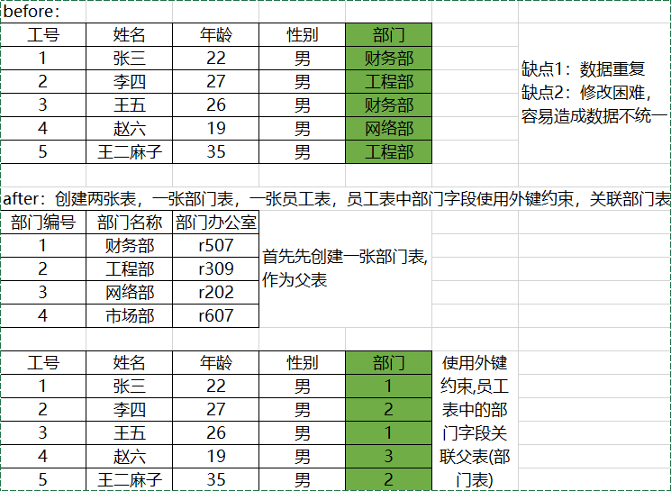

# 表的完整性约束-外键约束

- 外键约束（FOREIGN KEY，缩写FK）是用来实现数据库表的参照完整性的。外键约束可以使两张表紧密的结合起来，特别是针对修改或者删除的级联操作时，会保证数据的完整性。
- 外键是指表中某个字段的值依赖于另一张表中某个字段的值，而被依赖的字段必须具有主键约束或者唯一约束。被依赖的表我们通常称之为父表或者主表，设置外键约束的表称为子表或者从表。



## 代码示例

- 先创建一个部门表(父表)

```mysql
-- 先创建父表：部门表：
create table department(
        dno int(4) primary key auto_increment,
        dname varchar(10) not null,
        room char(4)
)
```

- 创建员工表,并添加外键约束==外键约束只有表级约束,没有列级约束==

```mysql
-- 注意：外键约束只有表级约束，没有列级约束：
-- 方法一:创建表的时候添加外键约束
create table staff(
        eid int(6) primary key auto_increment, 
        name varchar(5) not null, 
        department int(4),
    	-- 取值参考department表中的dno字段，不要求字段名字完全重复，但是类型长度定义 尽量要求相同。
        constraint fk_staff_department foreign key (department) references department (dno)
);

-- 方法二:创建完表后添加外键约束
create table staff(
        eid int(6) primary key auto_increment, 
        name varchar(5) not null, 
        department int(4)
);
-- 在创建表以后添加外键约束：
alter table staff add constraint fk_staff_department foreign key (department) references department (dno)

```

## 外键策略

- 对于有外键约束的表格,可以设置外键策略来达到在==操作父表的时候,子表也响应的作出策略定义的修改==

- 外键策略有三个

  - 策略1：no action 不允许操作

  ```mysql
  -- 外键策略 no action
  delete from department where dno = 2;
  -- > 1451 - Cannot delete or update a parent row: a foreign key constraint fails (`mytestdb`.`staff`, CONSTRAINT `fk_staff_department` FOREIGN KEY (`department`) REFERENCES `department` (`dno`))
  -- 默认删除的外键策略是no action 如果删除删除有员工的部门的话,就会出错,不让直接删除
  ```

  - 策略2：cascade 级联操作：主表中的数据被修改,那么子表关联的字段也跟着主表一起修改,比如父表中部门编号被修改,那么子表中的部门也会相应的被修改

  ```mysql
  -- 先删除之前的外键约束：
  alter table staff drop foreign key fk_staff_department;
  -- 重新添加外键约束：
  alter table staff add constraint fk_staff_department foreign key (department) references department (dno) on update cascade on delete cascade;
  -- on update cascade 与 on delete cascade; 
  -- 表示修改,与删除都设置为级联策略
  -- 那么部门表中,更改了部门编号,子表中部门编号就跟着自动修改,
  -- 要是删除了某个部门,那么这个部门的所有员工信息也都降被删除.
  ```

  - 策略3：set null  置空操作：主表数据被修改,那么子表关联的字段设置为空,比如父表中某个部门被删除,设置了set null后,子表中该部门的员工信息部门字段会被设置为null,如果不设置为set null的话,父表部门被删除,子表中该部门的员工信息也同时被删除

  ```mysql
  -- 先删除之前的外键约束：
  alter table staff drop foreign key fk_staff_department;
  -- 重新添加外键约束：
  alter table staff add constraint fk_staff_department foreign key (department) references department (dno) on update set null on delete set null;
  -- on update set null  与  on delete set null;
  -- 表示修改,与删除都设置为set null策略
  -- 那么部门表中,更改了部门编号,子表中该部门员工的部门字段都被修改为null,
  -- 要是删除了某个部门,那么这个部门的所有员工部门字段都被修改为null.
  ```

- 一般策略2与策略3搭配进行使用,修改的时候,级联进行修改,删除的时候set null

  ```mysql
  -- 先删除之前的外键约束：
  alter table staff drop foreign key fk_staff_department;
  -- 重新添加外键约束：
  alter table staff add constraint fk_staff_department foreign key (department) references department (dno) on update cascade on delete set null;
  -- on update cascade on delete set null;
  -- 表示修改使用级联策略,删除使用set null策略
  -- 那那么部门表中,更改了部门编号,子表中部门编号就跟着自动修改,
  -- 要是删除了某个部门,那么这个部门的所有员工部门字段都被修改为null.
  ```

  