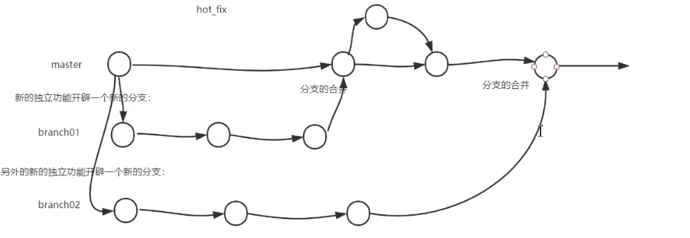

# Git-分支

- 在版本控制过程中，使用多个分支同时推进多个任务

- 分支的好处
  - 多个分支可以并行开发，互不影响，提高开发效率
  - 如果一个分支开发有问题，直接删除分支就可以了，不会影响其他分支

## 分支管理的常用命令

- `git branch`查看当前所有的分支，只返回分支名
- `git branch -v`查看当前所有的分支，返回分支名、版本索引与备注
- `git branch 分支名`创建分支
- `git checkout 分支名`切换到目标分支
- `git merge 分支名`将目标分支合并到当前分支
  - 如果当前分支与目标分支，对同一个文件的同一个位置进行了修改，会出现冲突
  - 出现冲突之后，人为决定需要保留的内容，即:将文件中不需要的部分删除掉，然后将文件分别提交到暂存区与本地库
  - 解决冲突之后，提交到本地库的时候`git commit`后面不要带上文件名
  
  