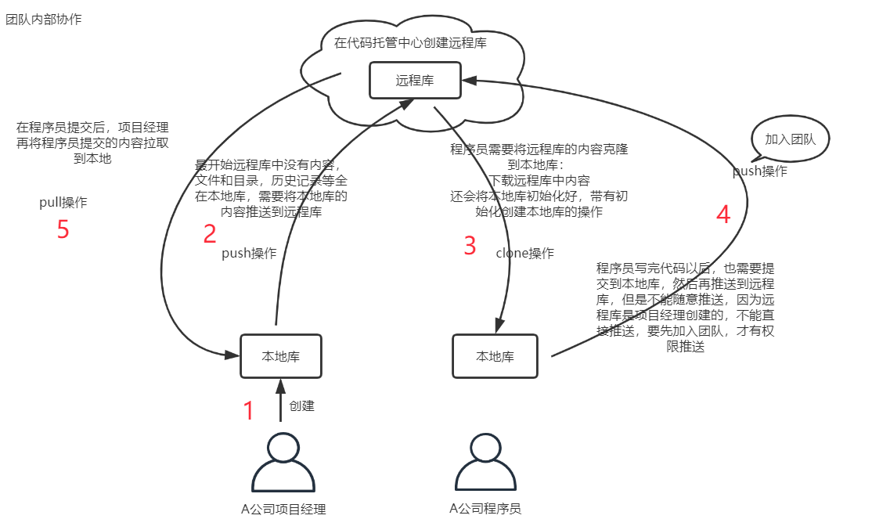
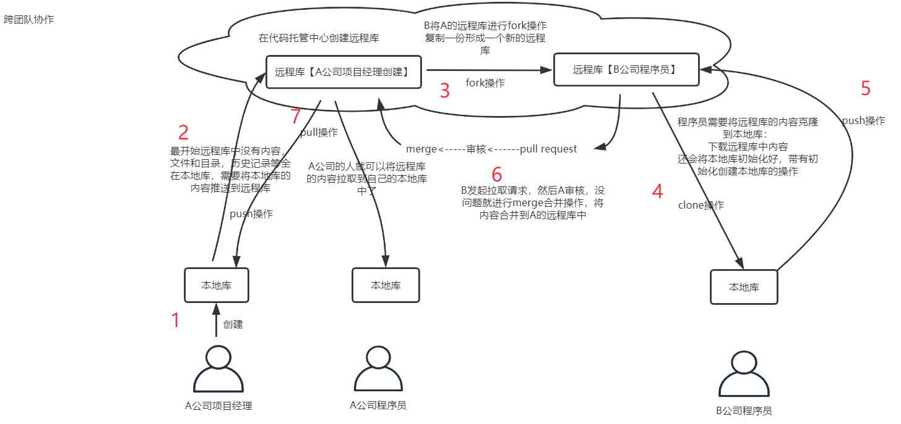
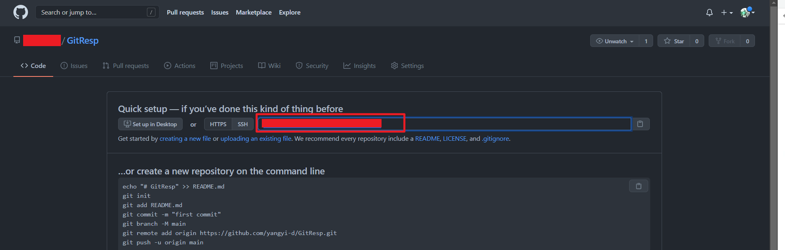
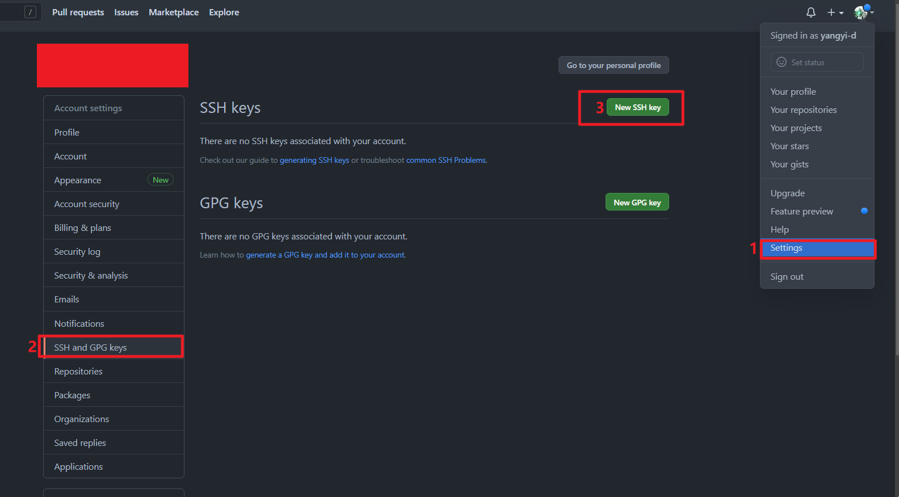
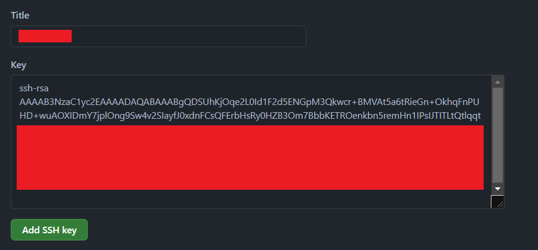

# Git本地库与远程库交互

- 在进行团队协作开发的时候，Git本地库的功能就不能满足协作需求了，所以需要代码托管中心
- 在局域网下，可以大家GitLab服务器作为代码托管中心，GitLab需要自己搭建
- 在互联网情况下，可以有GitHub或者Gitee作为代码托管中心，GitHub与Gitee是现成代码托管中心，不用自己大家
- 团队内部协作开发

- 跨团队协作开发

## Git本地库与GitHub远程库进行交互

- 首先在GitHub上注册自己的账户，并创建远程仓库
- 获取GitHub远程库的链接

- 在本地给GitHub远程库地址添加别名（也可以不加，但是不加的话每次进行交互的时候都需要输入远程库的完整链接，比较麻烦）
  - `git remote add 远程库别名 远程库地址`添加远程库别名
  - `git remote`查看已经添加的远程库别名
  - `git remote -v`查看已添加的远程库别名的详细信息
- `git push 远程库别名 分支名`将目标分支的内容推送到远程库

- `git clone 远程库地址`将远程库地址克隆到本地

- `git fetch 远程库别名 远程库分支名`将远程库上目标分支的内容拉去到本地
  - 这个时候，本地库还没有与远程库的内容合并，只是将数据下载到了本地
- `git checkout 远程库别名/远程库分支`将分支切换到远程库的目标分支上
  - 这样可以直接在本地查看远程库上的文件内容
- `git merge 远程库别名/远程库分支`远程库上的内容拉取到本地之后，使用此命令，将远程库的内容与本地库内容进行合并

- `git pull 远程库别名 远程库分支名`将远程库的内容拉取并合并到本地库，相当于`git fetch`与`git merge`两个操作的合并
  - 远程库与本地库内容冲突解决方案：
    - 首先将远程库的内容拉取到本地`git pull 远程库别名 远程库分支名`
    - 人为解决冲突（对有冲突部分的代码进行修改调整）
    - 将修改后的内容提交到暂存区`git add 文件名`
    - 将修改后的内容提交到本地库`git commit -m "xxxxx"`注意：解决冲突后的内容，commit的时候不能带文件名
    - 将本地库内容推送到远程库`git push 远程库别名 远程库分支名`
  - 当远程库与本地库是两个不相关的库的时候，仍然想要将远程库的内容拉取到本地，`git pull`就需要添加`--allow-unrelated-histories`参数
    - `git pull 远程库别名 远程库分支名 --allow-unrelated-histories`
    - `--allow-unrelated-histories`这个参数告诉 git 允许不相关历史合并
    - 这个方法只解决因为两个仓库有不同的开始点，也就是两个仓库没有共同的 commit 出现的无法提交。如果使用本文的方法还无法提交，需要看一下是不是发生了冲突，解决冲突再提交

## SSH免密登录

- 首先进入到用户主目录`cd ~`
- 执行命令，生成一个.ssh的目录`ssh-keygen -t rsa -C xxxx@xxx.com`后面需要加上远程库账户的邮箱地址

- 将`.ssh`目录中id_rad.pub文件中的内容，复制设置到远程库的SSH设置中
- 然后后面将本地库内容推送到远程库的时候使用SSH的方式就可以完成免密登录了
- 优缺点
  - 优点：不用每次都进行账号密码验证
  - 缺点：只支持一个账户

