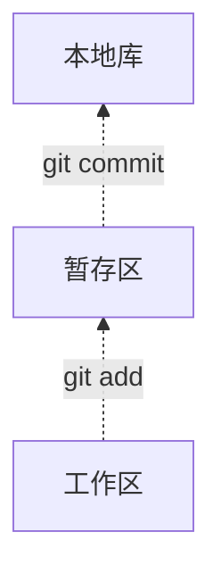

# Git的概念

- Git是一个免费的、开源的分布式版本控制系统，可以快速高效的处理从小到大的项目
- Git的结构

## 初始化本地仓库

## Git的常用命令

### Git的配置与仓库初始化命令

- `Git --version`查看Git的版本
- ` git config --global user.name "XXXX"`设置用户名
- `git config --global user.email "xxxxxxxxxx@xxx.com"`设置邮箱
- `git init`初始化仓库（需要进入到目标目录或者在命令后面带上目标目录的路径）
- 注意：`.git`目录下的本地库相关相关的目录和子文件不要删除，也不要胡乱修改

### 提交管理命令

- `git add 文件名称`将目标文件提交到暂存区
- `git commit -m "xxxx"`将暂存区的文件，提交到本地库

  - `-m "xxx"`表示提交的时候的注释
- 工作区中文件删除，想要将暂存区与本地库中的文件同步删除操作的话，也是使用上面两个命令进行操作

### 查看状态与操作日志

- `git status"`查看工作区与暂存区的状态，是否有修改
- `git log`查看操作的日志
  - 当历史记录过多的时候，查看日志的会有分屏的效果，按`空格`进入下一页，按`b`进入上一页，按`q`退出
  - `git log --pretty=oneline`一行格式化显示日志
  - `git log --oneline`一行简洁格式化显示日志
  - `git reflog`带HEAD的简洁格式化显示日志

### 版本的前进与回退

- `git reset --hard 索引`可以前进或者后退历史版本，XXXX是版本的索引，本地库的指针移动的时候，会重制暂存区与工作区
- `git reset --mixed 索引`可以前进或者后退历史版本，XXXX是版本的索引，本地库的指针移动的时候，会重制暂存区，但是工作区不动
- `git reset --soft 索引`可以前进或者后退历史版本，XXXX是版本的索引，本地库的指针移动的时候，暂存区与工作区都不动

### 比对文件差异

- `git diff xxxx`查看某个文件工作区与暂存区文件的差异
- `git diff`查看工作区与暂存区所有文件的差异
- `git diff 本地库索引 文件名`查看某个文件暂存区与本地库的差异