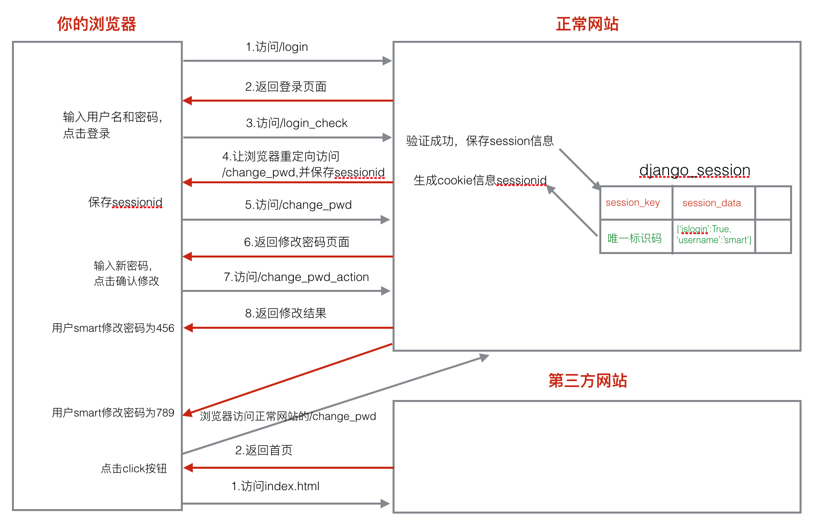

##### CSRF

 &emsp;CSRF全拼为Cross Site Request Forgery，译为跨站请求伪造。CSRF指攻击者盗用了你的身份，以你的名义发送恶意请求。CSRF能够做的事情包括：以你名义发送邮件，发消息，盗取你的账号，甚至于购买商品，虚拟货币转账......造成的问题包括：个人隐私泄露以及财产安全 ;



* django防止csrf的方式：

1. 默认打开csrf中间件。

2. 表单post提交数据时加上标签。

**防御原理:**

1. 渲染模板文件时在页面生成一个名字叫做csrfmiddlewaretoken的隐藏域。

2. 服务器交给浏览器保存一个名字为csrftoken的cookie信息。

提交表单时，两个值都会发给服务器，服务器进行比对，如果一样，则csrf验证通过，否则失败。

**CSRF防御**

```python
MIDDLEWARE_CLASSES = (
    'django.contrib.sessions.middleware.SessionMiddleware',
    'django.middleware.common.CommonMiddleware',
    'django.middleware.csrf.CsrfViewMiddleware', # django默认启用了csrf防护，只针对post提交
    'django.contrib.auth.middleware.AuthenticationMiddleware',
    'django.contrib.auth.middleware.SessionAuthenticationMiddleware',
    'django.contrib.messages.middleware.MessageMiddleware',
    'django.middleware.clickjacking.XFrameOptionsMiddleware',
    'django.middleware.security.SecurityMiddleware',
)

<form method="post" action="/change_pwd_action">
    
    新密码:<input type="password" name="pwd">
    <input type="submit" value="确认修改">
</form>
```


