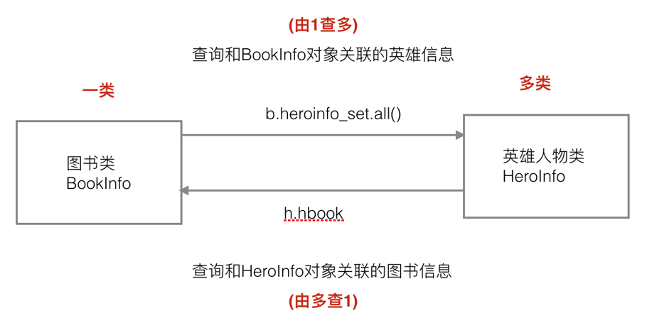
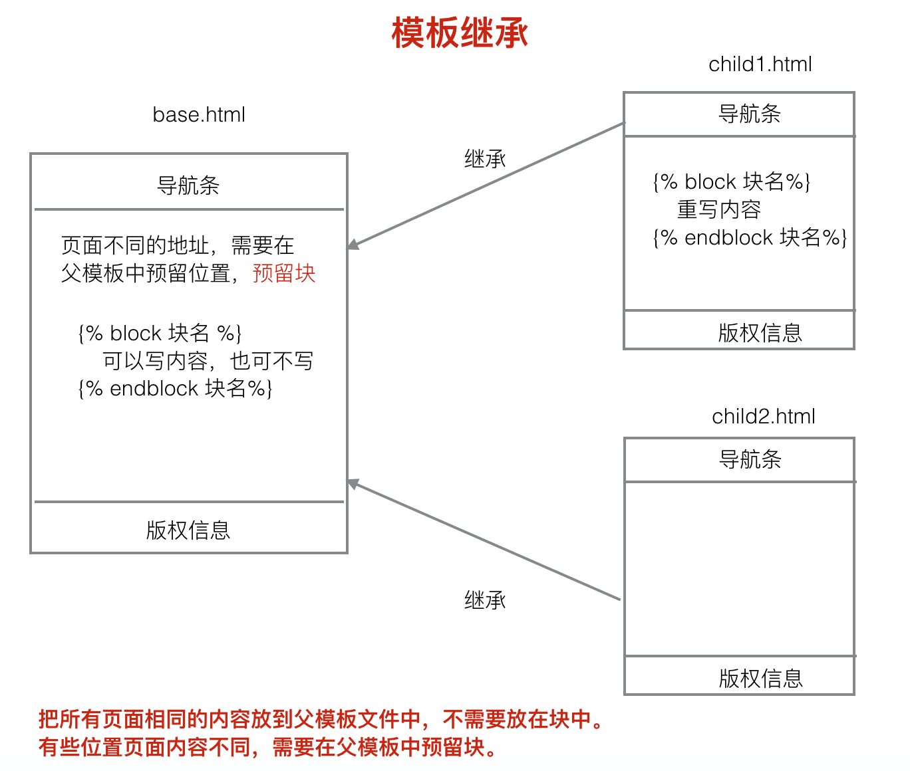
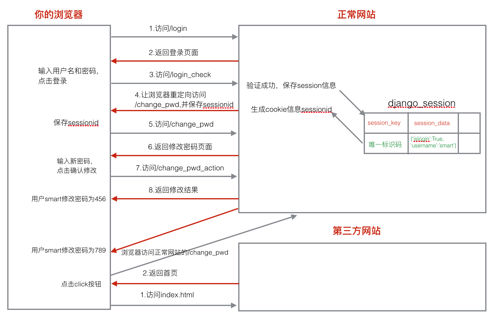
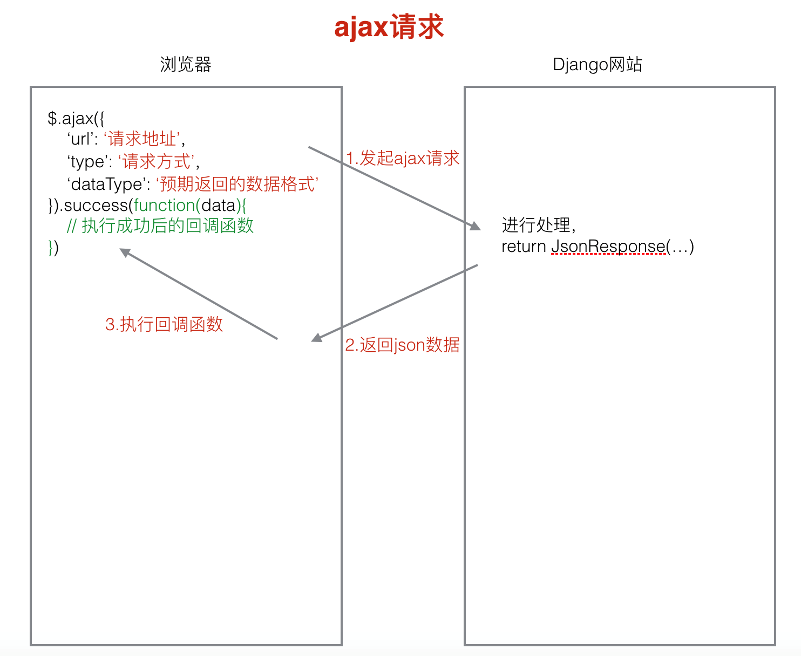
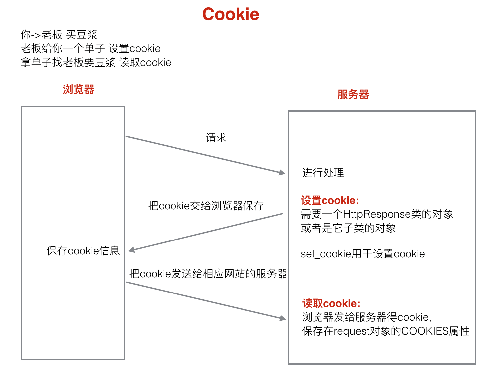
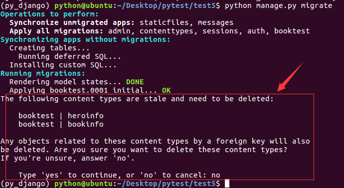
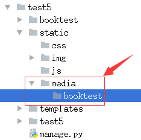

# Python Django使用


## 认识Django

[参考文档]( https://docs.djangoproject.com/zh-hans/3.0/ )

### 1、MVC框架

mvc框架是一种软件设计模式

* 简介

	MVC的生产理念：<font color=red>分工</font>。让专门的人去做专门的事情。

	MVC的核心思想：<font color=red>解耦</font>

	MVC的思想被应用在web开发方面，就产生了<font color=red>web MVC框架</font>

* Web MVC框架的模块功能


1. M: Model,模型，与数据库进行交互。
2. V: View,视图，产生html页面。
3. C: Controller，控制器，接收请求，进行处理，与M和V进行交互，返回应答。

---

### 2、Django框架

* 简介
	Django框架遵循MVC的思想，但是有自己的名词，叫做<font color=red>MVT</font>
	Django遵循<font color=red>快速开发</font>和<font color=red>DRY</font>的原则。DRY：Do not repeat yourself。


1. M:Model,模型， 和MVC中M功能相同，和数据库进行交互。

2. V:View,视图， 和MVC中C功能相同，接收请求，进行处理，与M和T进行交互，返回应答。

3. T:Template,模板， 和MVC中V功能相同，产生html页面。

---

## Django使用

### 1、创建Django项目

命令：`django-admin startproject 项目名`

项目目录如下：

```
yangyi@yangyi-virtual-machine:~/桌面/test2$ tree
.
├── manage.py
└── test2
    ├── __init__.py
    ├── settings.py
    ├── urls.py
    └── wsgi.py
```

* `__init__.py`说明test2是一个python包
* `settings.py`整个项目的配置文件
* `urls.py`进行url路由的配置
* `wsgi.py`web服务器和Django交互的入口
* `manage.py`项目的管理文件

---

### 2、创建Django应用

&emsp;在Django中，一个<font color=red>功能模块</font>分别使用一个<font color=red>应用</font>来实现，整个项目由很多个应用组成，每一个应用完成一个功能模块，例如：整个网页可以分为<font color=red>用户模块、商品模块、购物模块、订单模块</font>。

命令：`python manage.py startapp 应用名`

<font color=red>注意：创建应用的时候，需要先进入项目目录内</font>

应用目录如下：

```
yangyi@yangyi-virtual-machine:~/桌面/test2/booktest$ tree
.
├── admin.py
├── __init__.py
├── migrations
│   ├── __init__.py
├── models.py
├── tests.py
└── views.py
```

* `__init__.py`: 说明目录是一个Python模块。
* `models.py`: 写和数据库项目的内容, 设计模型类。
* `views.py`: ，接收请求，进行处理，与M和T进行交互，返回应答。
* `tests.py`: 写测试代码的文件。
* `admin.py`: 网站后台管理相关的文件。

---

### 3、Django应用注册

&emsp;应用创建后，为了建立应用和项目之间的联系，需要对<font color=red>应用进行注册</font>，注册的方法：修改`settiongs.py`中的`INSTALLED_APPS`的配置

```python
INSTALLED_APPS = [
    'django.contrib.admin',
    'django.contrib.auth',
    'django.contrib.contenttypes',
    'django.contrib.sessions',
    'django.contrib.messages',
    'django.contrib.staticfiles',
    'booktest', # 注册应用，以上的应用都是Django项目自带的应用
]
```

---

### 4、启动Django项目

运行开发web服务器命令

`python manage.py runserer`

---

### 5、Django三大模块

#### ①、模型类

##### ORM

&emsp;django中内嵌了ORM框架，ORM框架可以将类和数据表进行对应，只需要通过类和对象就可以对数据表进行操作。


在Django中主要的设计类：<font color=red>模型类</font>

ORM的另一作用：<font color=red>根据设计的类，生成数据库中的表</font>

##### 模型类的设计

&emsp;设计模型类，需要在应用的`models.py`中进行

&emsp;模型类必须继承`models.Model`类

```python
from django.db import models

# Create your models here.


# 一类
class BookInfo(models.Model):
    '''图书模型类'''
    
    # 图书名 CharField说明是一个字符串，max_length指定字符串的最大长度
    btitle = models.CharField(max_length=20)
    # 出版日期 Datefield说明是一个日期类型
    bpub_date = models.DateField()

    def __str__(self):
        # 改写魔法属性，返回书名
        return self.btitle
    
# 多类
class HeroInfo(models.Model):
    """英雄人物类"""
    
    # 英雄名 hname
    hname = models.CharField(max_length=20)
    # 性别 hgender BooleanField说明是bool类型 default指定默认值 False代表男
    hgender = models.BooleanField(default=False)
    # 备注
    hcomment = models.CharField(max_length=128)
    # 属性关系 book 建立图书类和英雄人物类之间的一对多关系
    hbook = models.ForeignKey(BookInfo, on_delete=models.CASCADE)
    def __str__(self):
        # 改写魔法属性，返回英雄名
        return self.hname
```

&emsp;<font color=red>Models.ForeignKey</font>可以建立两个模型类之间一对多的关系，django在生成表的时候，就会在多端的表中创建一列作为外键，建立两个表之间一对多的关系。

##### 模型类的字段属性和选项

1. **模型类属性命名限制**

* 不能是python的保留关键字
* 不允许使用连续的下划线（这是由于Django的查询方式决定的）
* 定义属性时，需要指定字段类型，通过字段类型的参数指定选项，例：<font color=red>属性名=models.字段类型(选项)</font>

2. **字段类型**

|                          类型                          |                             描述                             |
| :----------------------------------------------------: | :----------------------------------------------------------: |
|                     **AutoField**                      | 自动增长的IntegerField，通常不用指定，不指定时Django会自动创建属性名为id的自动增长属性。 |
|                    **BooleanField**                    |                 布尔字段，值为True或False。                  |
|                  **NullBooleanField**                  |                支持Null、True、False三种值。                 |
|           **CharField**(max_length=最大长度)           |           字符串。参数max_length表示最大字符个数。           |
|                     **TextField**                      |            大文本字段，一般超过4000个字符时使用。            |
|                    **IntegerField**                    |                             整数                             |
| **DecimalField**(max_digits=None, decimal_places=None) | 十进制浮点数。参数max_digits表示总位。参数decimal_places表示小数位数。 |
|                     **FloatField**                     |                       浮点数。参数同上                       |
| **DateField：**([auto_now=False, auto_now_add=False])  | 日期。  1)参数auto_now表示每次保存对象时，自动设置该字段为当前时间，用于"最后一次修改"的时间戳，它总是使用当前日期，默认为false。  2) 参数auto_now_add表示当对象第一次被创建时自动设置当前时间，用于创建的时间戳，它总是使用当前日期，默认为false。  3)参数auto_now_add和auto_now是相互排斥的，组合将会发生错误。 |
|                     **TimeField**                      |                   时间，参数同DateField。                    |
|                   **DateTimeField**                    |                 日期时间，参数同DateField。                  |
|                     **FileField**                      |                        上传文件字段。                        |
|                     **ImageField**                     |  继承于FileField，对上传的内容进行校验，确保是有效的图片。   |

3. **选项**

|     选项名      |                             描述                             |
| :-------------: | :----------------------------------------------------------: |
|   **default**   |                     默认值。设置默认值。                     |
| **primary_key** | 若为True，则该字段会成为模型的主键字段，默认值是False，一般作为AutoField的选项使用。 |
|   **unique**    |   如果为True, 这个字段在表中必须有唯一值，默认值是False。    |
|  **db_index**   |   若值为True, 则在表中会为此字段创建索引，默认值是False。    |
|  **db_column**  |          字段的名称，如果未指定，则使用属性的名称。          |
|    **null**     |          如果为True，表示允许为空，默认值是False。           |
|    **blank**    |       如果为True，则该字段允许为空白，默认值是False。        |

<font color=red>         对比：null是数据库范畴的概念，blank是后台管理页面表单验证范畴的  </font>

&emsp;当修改模型类之后，如果添加的选项不影响表的结构，则不需要重新做迁移，商品的选项中default和blank不影响表结构。

> [官方参考文档](http://python.usyiyi.cn/translate/django_182/index.html)

##### 模型类生成表

1. 首先需要生成迁移文件

&emsp;命令：`python manage.py makemigrations`

&emsp;这样在应用的`migrations`文件夹中就会生成迁移文件

2. 执行迁移生成表

&emsp;命令：`python manage.py migrate`

&emsp;根据迁移文件生成表，生成的表名的默认格式：<font color=red>应用名_模型类名小写</font>，例：`booktest_bookinfo`

##### 通过模型类操作数据表

&emsp;首先需要进入项目`shell`

&emsp;命令：`python manage.py shell`进入项目交互模式

* 首先需要导入模型类：

  `from booktest.models import BookInfo,HeroInfo`

1. 向`booktest_bookinfo`表中插入一条数据

```
b = BookInfo() #定义一个BookInfo类的对象
b.btitle ='天龙八部' #定义b对象的属性并赋值
b.bpub_date = date(1990,10,11) 
b.save() #才会将数据保存进数据库
```

2. 查询出`booktest_bookinfo`表中id为1的数据

```
b = BookInfo.objects.get(id=1) 
```

3. 改变b对应图书的出版日期

```
b.bpub_date = date(1989,10,21)
b.save() #才会更新表格中的数据
```

4. 删除b对应的图书的数据

```
b.delete() #才会删除
```

5. 向`booktest_heroinfo`表中插入一条数据

```
h = HeroInfo()
h.hname = '郭靖'
h.hgender = False
h.hcomment = ‘降龙十八掌’
b2 = BookInfo.objects.get(id=2)
h.hbook = b2  #给关系属性赋值，英雄对象所属的图书对象
h.save()
```

6. 查询图书表里的所有内容

```
BookInfo.objects.all()
HeroInfo.objects.all()
```

##### 模型类的查询操作

* 查询函数：通过`模型类.objects`属性可以调用查询函数，实现对模型类对应的数据表进行查询

|  函数名  | 功能 | 返回值 | 说明 |
| :------: | :----: | :------: | :----: |
|   get    | 返回表中满足条件的<font  color=red>一条数据，且只能有一条数据</font> | 返回值是一个模型类对象 | 参数中写查询条件。查询到多条数据，抛出异常：MultipleObjectsReturned。查询不到数据抛出异常：DoesNotExist。 |
|   all    | 返回模型类对应表格中的<font  color=red>所有数据</font> | <font  color=red>返回值是查询集（QuerySet）</font> | 无参数 |
|  filter  | 返回<font  color=red>满足</font>条件的数据 | <font  color=red>返回值是查询集（QuerySet）</font> | 参数写查询条件 |
| exclude  | 返回<font  color=red>不满足</font>条件的数据 | <font  color=red>返回值是查询集（QuerySet）</font> | 参数写查询条件 |
| order_by | 对查询结果进行排序 | <font  color=red>返回值是查询集（QuerySet）</font> | 参数中写根据哪些字段进行排序 |

* 查询条件：用于查询函数中的条件。条件格式：`模型类属性名__条件名=值`<font color=red>(双下划线)</font>

| 条件 | 解释 | 示例 |
| :----: | :----: | :----: |
| exact | 判断是否相等，可直接使用 = | BookInfo.objects.get(id__exact=1) |
| contains | 包含 | BookInfo.objects.filter(btitle__contains="传") |
| startswith | 以什么开头 | BookInfo.objects.filter(btitle__startswith="部") |
| endswith | 以什么结尾 | BookInfo.objects.filter(btitle__endswith="部") |
| isnull | 空查询 | BookInfo.objects.filter(btitle__isnull=False) |
| in | 范围查询 | BookInfo.objects.filter(id__in=[1,3,5]) |
| gt | 大于(greate than) | BookInfo.objects.filter(id__gt=3) |
| lt | 小于(less than) | BookInfo.objects.filter(id__lt=3) |
| gte | 大于等于 | BookInfo.objects.filter(id__gte=3) |
| lte | 小于等于 | BookInfo.objects.filter(id__lte=3) |
| year | 日期查询 | BookInfo.objects.filter(bpub_date__year=1980)      BookInfo.objects.filter(bpub_date__gt=date(1980,1,1)) |
| order_by | 从小到大排序 | BookInfo.objects.all().order_by('id') |
| order_by | 从大到小排序 | BookInfo.objects.all().order_by('-id') |

##### 查询集

&emsp;all，filter，exclude，order_by，调用这些函数回产生一个查询集，QuerySet类对象可以继续调用上面的所有函数

* **查询集的特性**

1. 惰性查询：<font color=red>只有在实际使用查询集中的数据的时候才会发生对数据库的真正查询。</font>

2. 缓存：<font color=red>当使用的是同一个查询集时，第一次使用的时候会发生实际数据库的查询，然后把结果缓存起来，之后再使用这个查询集时，使用的是缓存中的结果。</font>

*  **限制查询集**  

1. 可以对一个查询集进行取下标或者切片操作来限制查询集的结果。

2. 对一个查询集进行切片操作**会产生一个新的查询集**,下标不允许为负数

示例：

|     方式     |                       说明                       |
| :----------: | :----------------------------------------------: |
|     b[0]     |       如果b[0]不存在，会抛出IndexError异常       |
| b[0:1].get() | 如果b[0:1].get()不存在，会抛出DoesNotExist异常。 |
|    exists    |      判断一个查询集中是否有数据。True False      |

##### 模型类的关系

* 一对多关系

&emsp;例如：图书类-角色类，对应关系定义在多类中

  ```python
  models.ForeignKey() # 括号中指定对应的类名
  ```

* 多对多关系

&emsp;例如：新闻类-新闻类型类，对应关系可以随便定义在哪个类中

```python
models.ManyToManyField() # 括号中指定对应的类名
```

* 一对一关系

&emsp;例如：员工基本信息类-员工详细信息类，对应关系可以随便定义在哪个类中

```python
models.OneToOneField() # 括号中指定对应的类名
```

##### 关联查询（一对多关系）

&emsp;多类中定义的建立关联的类新型叫做关联属性

|  查询条件  |                      一般方法                      |               模型类查询                |
| :--------: | :------------------------------------------------: | :-------------------------------------: |
| 一类查多类 | b=BookInfo.objects.get(id=1)，b.heroinfo_set.all() |  HeroInfo.objects.filter(hbook__id=1)   |
| 多类查一类 |      h = HeroInfo.objects.get(id=1)，h.hbook       | BookInfo.objects.filter(heroinfo__id=1) |

<font color=red>注意：</font>

1. 通过模型类实现关联查询时，要查哪个表中的数据，就需要通过哪个类来差。
2. 写关联查询条件的时候，如果类中没有关系属性，条件需要写对应类的名，如果类中有关系属性，直接写关系属性。

##### F对象

&emsp;F对象是用于类属性之间进行比较的，在使用F对象之前，需要先导入F对象`from django.db.models import F`

示例：

```python
# 查询图书阅读量大于评论量的图书信息
BookInfo.objects.filter(bread__gt=F('bcomment'))
# 查询涂上阅读量大于2倍评论量的图书信息
BookInfo.objects.filter(bread__gt=F('bcomment')*2)
```

##### Q对象

&emsp;Q对象是用于查询时判断条件之间的逻辑关系<font color=red>not，and，or</font>可以对Q对象进行<font color=red>~，&，|</font>操作。在使用Q对下行之前，需要先导入Q对象`from django.db.models import Q`

示例：

```python
# 查询id大于3且阅读量大于30的图书的信息。
BookInfo.objects.filter(id__gt=3, bread__gt=30)
BookInfo.objects.filter(Q(id__gt=3)&Q(bread__gt=30))
# 查询id大于3或者阅读量大于30的图书的信息。
BookInfo.objects.filter(Q(id__gt=3)|Q(bread__gt=30))
# 查询id不等于3图书的信息。
BookInfo.objects.filter(~Q(id=3))
```

##### 关联操作



&emsp;查询出id为2的图书中所有英雄人物的信息

```python
b = BookInfo.objects.get(id=2)
b.heroinfo_set.all() # 查询出b图书中所有英雄人物的信息

HeroInfo.objects.filter(hbook__id=1) # 模型类查询
```

##### 自关联

<font color=red>&emsp;自关联就是特殊的一对多的关系</font>;只是所有的关联都在一张表里面，在定义数据表的时候就在表中定义关系属性；<font color=red>自关联查询依然遵循关联查询操作原则</font>

```python
class AreaInfo(models.Model):
    """自关联模型类"""
    # 地区名称
    atitle = models.CharField(max_length=20)
    # 关系属性，代表当前地区的父级地区
    aparent = models.ForeignKey('self', null=True, blank=True)
```

##### 聚合函数

&emsp;对查询结果进行聚合；(sum,count,avg,max,min)

* **aggregate：**调用这个函数来使用聚合，返回值是一个字典；

使用前需要先导入<font color=red>聚合类</font>`form django.db.models import Sum,Count,Max,Min,Avg`

示例：

```python
# 查询所有图书的数目。
BookInfo.objects.all().aggregate(Count('id'))
{'id__count': 5}
# 查询所有图书阅读量的总和。
BookInfo.objects.aggregate(Sum('bread'))
{'bread__sum': 126}
```

* **count：**统计满足条件数据的数目，返回值是一个数字；

示例：

```python
# 统计所有图书的数目。
BookInfo.objects.all().count()
BookInfo.objects.count()
# 统计id大于3的所有图书的数目。
BookInfo.objects.filter(id__gt=3).count()
```


##### 管理器

&emsp;BookInfo.objects.all()--->objects是Django自动生成的管理器对象，通过管理器对象可以实现数据查询操作；

&emsp;objects是models.Manger类的一个对象。自定义管理器之后Django就不再自动生成objects管理器。

* **自定义模型管理器类**

1. 自定义一个管理器类，这个类继承models.Manger类。

2. 再在具体的模型类里定义一个自定义管理器类的对象。

```python
class BookInfoManager(models.Manager):
    '''图书模型管理器类'''
    # 1.改变原有查询的结果集
    def all(self):
        # 1.调用父类的all方法，获取所有数据
        books = super().all() # QuerySet
        # 2.对books中的数据进行过滤
        books = books.filter(isDelete=False)
        # 返回books
        return books

    # 2.封装方法，操作模型类对应的数据表（增删改查)
    def create_book(self, btitle, bpub_date):
        '''添加一本图书'''
        # 1.创建一个图书对象
        # 获取self所在的模型类
        model_class = self.model
        book = model_class()
        # book = BookInfo()
        book.btitle = btitle
        book.bpub_date = bpub_date
        # 2.添加进数据库
        book.save()
        # 3.返回book
        return book
```

* **自定义管理器类的应用场景**

1. 改变查询的结果集。

比如调用BookInfo.books.all()返回的是没有删除的图书的数据。

2. 添加额外的方法。

管理器类中定义一个方法帮我们操作模型类对应的数据表。

使用self.model()


##### 元选项

**Django**默认生成的表名：<font color=red>应用名小写_模型类名小写</font>

**元选项：**可以指定数据库中表名

需要在模型类中定义一个元类Meta,在里面定义一个类属性db_table就可以指定表名。

```python
    class Meta:
        db_table = 'bookinfo' # 指定模型类对应表名
```


#### ②、视图

&emsp;要使浏览器能显示东西，首先就需要定义视图函数，浏览器请求一个页面的时候，Django使用视图函数来处理这个请求

##### 定义视图函数

&emsp;request参数必须有。request参数是一个HttpRequest类型的对象。参数名可以变化，

但不要更改;

```python
def index(request): # 视图函数必须有 request 参数
    '''显示图书信息'''
    
    # 1、查询所有图书信息
    books = BookInfo.objects.all() # 视图函数中需要进行的处理
    
    # return HttpResponse('hello python') 函数处理完成后需要返回HttpResponse的类对象，下面使用模板的方法是简写的方法
    # 2、使用模板
    return render(request, 'booktest/index.html', {'books': books})
```

##### 进行url配置

为了建立url和视图函数的对应关系，需要配置url。url配置项定义在urlpatterns的列表中，每一个配置项都调用url函数。

url函数有两个参数，第一个参数是一个正则表达式，第二个是对应的处理动作。

配置url时，有两种语法格式：

* url(正则表达式，视图函数名)

* url(正则表达式，include(应用中的urls文件))

工作中在配置url时，首先在项目的urls.py文件中添加配置项时，并不写具体的url和视图函数之间的对应关系，而是包含具体应用的urls.py文件，在应用的urls.py文件中写url和视图函数的对应关系。

* 项目urls.py配置：

```python
from django.contrib import admin
from django.urls import path, include

urlpatterns = [
    path('admin/', admin.site.urls),
    path(r'', include('booktest.urls')),
]
```

* 应用的urls.py配置

```python
from django.urls import path
from booktest import views

urlpatterns = [
    # url(r'^index$', views.index), # 图书信息页面
    # url(r'^create$', views.create), # 新增一本图书
    # url(r'^delete/(\d+)$', views.delete), # 删除点击的图书
    path(r'index', views.index, name='index')
]
```

##### URL匹配过程

**url:**http://127.0.0.1:8000/aindex?a=1

1. 去除域名和后面的参数，剩下/aindex,再把前面的/去掉，剩下aindex

2.  拿aindex先到项目的url.py文件中进行从上到下的匹配，匹配成功之后执行后面对应的处理动作，就是把匹配成功的部分a字符去除，然后拿剩下的部分index到应用的urls.py文件中再进行从上到下的匹配。

3. 如果匹配成功则调用相应的视图产生内容返回给客户端。如果匹配失败则产生404错误


##### 错误视图

* 404：找不到页面，关闭调试模式之后，默认会显示一个标准的错误页面，如果要显示自定义的页面，则需要的templates目录下面自定义一个404.html文件。

产生错误原因：

1. url没有配置

2. url配置错误

配置404.html

```html
<!DOCTYPE html>
<html lang="en">
<head>
    <meta charset="UTF-8">
    <title>404错误页面</title>
</head>
<body>
<h1>页面找不到--{{ request_path }}</h1>
</body>
</html>
```


* 500: 服务器端的错误。

产生错误原因：

1. 视图出错

配置500.html

```html
<!DOCTYPE html>
<html lang="en">
<head>
    <meta charset="UTF-8">
    <title>500错误页面</title>
</head>
<body>
<h1>服务器错误</h1>
</body>
</html>
```

* 网站开发完成需要关闭调试模式，在settings.py文件中：

```python
DEBUG=False
ALLOWED_HOST=[ '*']
```

##### 捕获URL参数

进行url匹配时，把所需要的捕获的部分设置成一个正则表达式组，这样django框架就会自动把匹配成功后相应组的内容作为参数传递给视图函数。

1. 位置参数

位置参数，参数名可以随意指定

2. 关键字参数：在位置参数的基础上给正则表达式组命名即可。

?P<组名>

关键字参数，视图中参数名必须和正则表达式组名一致

```python
 # 捕获url参数:位置参数
url(r'^showarg(\d+)$', views.show_arg),
# 捕获url参数:关键字参数
url(r'^showarg(?P<num>\d+)$', views.show_arg),
```


#### ③、模板

&emsp;模板不仅仅是一个html文件

* 模板文件的使用

1. 在项目文件夹新建模板文件夹`templates`
2. 配置项目`settings.py`中的`TEMPLATES`

```python
TEMPLATES = [
    {
        'BACKEND': 'django.template.backends.django.DjangoTemplates',
        'DIRS': [os.path.join(BASE_DIR, 'templates')], # 设置模板目录
        'APP_DIRS': True,
        'OPTIONS': {
            'context_processors': [
                'django.template.context_processors.debug',
                'django.template.context_processors.request',
                'django.contrib.auth.context_processors.auth',
                'django.contrib.messages.context_processors.messages',
            ],
        },
    },
]
```

3. 使用模板文件

<font color=red>在views.py中使用</font>

```python
def my_render(request, template_path, context_dict={}):
    # 加载模板文件 获取html内容
    temp = loader.get_template(template_path)
    # 定义模板上下文 给模板文件传数据
    res_context = context_dict
    # 模板渲染： 产生标准的HTML文件
    res_html = temp.render(res_context, request)
    # 返回给浏览器
    return HttpResponse(res_html)
```

<font color=red>以上步骤，Django已经封装好了render函数，可以简写</font>。

```python
def index(request):
    # 进行处理，和M和T进行交互
    # render函数直接完成模板加载，定义上下文与渲染步骤，第一个参数为request，第二个参数需要使用的模板，第三个参数为传递给模板的数据，必须是字典
    return render(request, 'booktest/index.html', {'content':'hello_world', 'list': list(range(1, 10))})

```

<font color=red>注意：给模板传递的数据必须是字典</font>。

4. 模板文件使用传递过来的参数，修改html文件

* 模板变量的使用`{{模板变量名}}`
* 模板代码段``
* for循环的使用方法：

```

	list不为空时执行的逻辑

	list为空时执行的逻辑

```

示例：

```html
<body>
    <h1>this is a line</h1>
    使用模板变量：<br/>
    {{content}}
    使用列表：<br/>
    {{list}}
    for循环：<br/>
    <ul>
        
            <li>{{ i }}</li>
        
    </ul>
</body>
```

##### 模板文件加载顺序

* 首先去配置的模板目录下面去找模板文件。

* 去INSTALLED_APPS下面的每个应用的templates去找模板文件，前提是应用中必须有templates文件夹。

##### 模板语言

* 模板语言简称为DTL。（Django Template Language）

###### 模板变量

模板变量名是由数字，字母，下划线和点组成的，<font color=red>不能以下划线开头。</font>

使用模板变量：{{模板变量名}}

<font color=red>模板变量的解析顺序：</font>

例如：{{ book.btitle }}

1. 首先把book当成一个字典，把btitle当成键名，进行取值book['btitle']

2. 把book当成一个对象，把btitle当成属性，进行取值book.btitle

3.  把book当成一个对象，把btitle当成对象的方法，进行取值book.btitle

例如：{{book.0}}

1. 首先把book当成一个字典，把0当成键名，进行取值book[0]

2. 把book当成一个列表，把0当成下标，进行取值book[0]

<font color=red>如果解析失败，则产生内容时用空字符串填充模板变量。</font>

**使用模板变量时，. 前面的可能是一个字典，可能是一个对象，还可能是一个列表。**

示例：

```python
# /temp_var
def temp_var(request):
    '''模板变量'''
    my_dict = {'title':'字典键值'}
    my_list = [1,2,3]
    book = BookInfo.objects.get(id=1)
    # 定义模板上下文
    context = {'my_dict':my_dict, 'my_list':my_list, 'book':book}
    return render(request, 'booktest/temp_var.html', context)
```

```html
<!DOCTYPE html>
<html lang="en">
<head>
    <meta charset="UTF-8">
    <title>模板变量</title>
</head>
<body>
使用字典属性:{{ my_dict.title }}<br/>
使用列表元素:{{ my_list.1 }}<br/>
使用对象属性:{{ book.btitle }}
</body>
</html>
```

###### 模板标签

[参考文档]( https://docs.djangoproject.com/zh-hans/3.0/ref/templates/builtins/#date )



  for循环：

  

  \# 列表不为空时执行

  

  \# 列表为空时执行

  

可以通过**{{ forloop.counter }}**得到for循环遍历到了第几次。









关系比较操作符：> < >= <= == !=

<font color=red>注意：进行比较操作时，比较操作符两边必须有空格。</font>

逻辑运算：not and or

示例：

```html
<!DOCTYPE html>
<html lang="en">
<head>
    <meta charset="UTF-8">
    <title>模板标签</title>
    <style>
        .red {
            background-color: red;
        }
        .yellow {
            background-color: yellow;
        }
        .green {
            background-color: green;
        }
    </style>
</head>
<body>
<ul>
    
        
            <li class="red">{{ forloop.counter }}--{{ book.btitle }}</li>
        
            <li class="yellow">{{ forloop.counter }}--{{ book.btitle }}</li>
        
            <li class="green">{{ forloop.counter }}--{{ book.btitle }}</li>
        
    
</ul>
</body>
</html>
```

###### 模板过滤器

[参考文档]( https://docs.djangoproject.com/zh-hans/3.0/ref/templates/builtins/#date )

<font color=red>过滤器用于对模板变量进行操作。</font>

date：改变日期的显示格式。

length:求长度。字符串，列表.

default:设置模板变量的默认值。

格式：模板变量｜过滤器：参数

自定义过滤器。

**自定义的过滤器函数，至少有一个参数，最多两个**

示例：

```html
<!DOCTYPE html>
<html lang="en">
<head>
    <meta charset="UTF-8">
    <title>模板过滤器</title>
    <style>
        .red {
            background-color: red;
        }
        .yellow {
            background-color: yellow;
        }
        .green {
            background-color: green;
        }
    </style>
</head>
<body>
<ul>

    
        
            <li class="red">{{ book.id }}--{{ book.btitle|length }}--{{ book.bpub_date|date:'Y年-m月-d日' }}</li>
        
            <li class="green">{{ book.btitle }}--{{ book.bpub_date }}</li>
        
    

    <!-- <h1>html注释</h1> -->
</ul>
default过滤器:<br/>
{{ content|default:'hello' }}
</body>
</html>
```

###### 自定义过滤器

1. 在应用目录下，新建python包<font color=red>templatetags</font>
2. 在templatetags中新建python文件，自定义过滤器<font color=red>（过滤器其实就是python的函数）</font>

示例：

```python
# 自定义过滤器
# 过滤器其实就是python函数
from django.template import Library

# 创建一个Library类的对象
register = Library()


# 自定义的过滤器函数，至少有一个参数，最多两个
@register.filter
def mod(num):
    '''判断num是否为偶数'''
    return num%2 == 0


@register.filter
def mod_val(num, val):
    '''判断num是否能被val整除'''
    return num%val == 0

@register.filter(name='cut')
def cut(value, arg):
    return value.replace(arg, '')

# 若你不填 name 参数，像第一个例子展示的一样，Django 会将函数名当做过滤器名若你不填 name 参数，像第二个例子展示的一样，Django 会将函数名当做过滤器名

```

html中需要引入过滤器：

```html
<!DOCTYPE html>
<html lang="en">

<head>
    <meta charset="UTF-8">
    <title>模板过滤器</title>
    <style>
        .red {
            background-color: red;
        }
        .yellow {
            background-color: yellow;
        }
        .green {
            background-color: green;
        }
    </style>
</head>
<body>
<ul>

    
        {#  #}
        {# #}
        
            <li class="red">{{ book.id }}--{{ book.btitle|length }}--{{ book.bpub_date|date:'Y年-m月-d日' }}</li>
        
            <li class="green">{{ book.btitle }}--{{ book.bpub_date }}</li>
        
    

    <!-- <h1>html注释</h1> -->
</ul>
default过滤器:<br/>
{{ content|default:'hello' }}
</body>
</html>
```

##### 模板注释

单行注释：{# 注释内容 #}

多行注释：

​      注释内容

​      

##### 模板继承

&emsp;模板继承是为了重用html页面内容。



**在父模板里可以定义块，使用标签：**



块中间可以写内容，也可以不写



子模板去继承父模板之后，可以重写父模板中的某一块的内容。

**继承格式：**



{{ block.super}} #获取父模板中块的默认内容

重写的内容



示例：

* 父模板

```html
<!DOCTYPE html>
<html lang="en">
<head>
    <meta charset="UTF-8">
    <title>父模板文件</title>
</head>
<body>
<h1>导航条</h1>

    <h1>这是父模板b1块中的内容</h1>


    <h1>这是父模板b2块中的内容</h1>

<h1>版权信息</h1>
</body>
</html>
```

* 子页面

```html

子模板文件

    {{ block.super }}
    <h1>这是子模板b1块中的内容</h1>



    {{ block.super }}
    <h1>这是子模板b2块中的内容</h1>

```

##### Html转义

在<font color=red>模板上下文</font>中的html标记默认是会被转义的。

```
小于号< 转换为&lt;
大于号> 转换为&gt;
单引号' 转换为&#39;
双引号" 转换为 &quot;
与符号& 转换为 &amp;
```

要关闭模板上下文字符串的转义：可以使用 {{ 模板变量|safe}}

也可以使用：



  模板语言代码



模板硬编码中的字符串默认不会经过转义，如果需要转义，那需要手动进行转义。

```html
<!DOCTYPE html>
<html lang="en">
<head>
    <meta charset="UTF-8">
    <title>html转义</title>
</head>
<body>
html转义:<br/>
{{ content }}<br/>
使用safe过滤器关闭转义:<br/>
{{ content|safe }}<br/>
使用autoescape关闭转义:<br/>

    {{ content }}
    {{ content }}
<br/>
模板硬编码中的字符串默认不会经过转义:<br/>
{{ test|default:'<h1>hello</h1>' }}<br/>
手动进行转义:<br/>
{{ test|default:'&lt;h1&gt;hello&lt;/h1&gt;' }}
</body>
</html>
```

##### CSRF

 &emsp;CSRF全拼为Cross Site Request Forgery，译为跨站请求伪造。CSRF指攻击者盗用了你的身份，以你的名义发送恶意请求。CSRF能够做的事情包括：以你名义发送邮件，发消息，盗取你的账号，甚至于购买商品，虚拟货币转账......造成的问题包括：个人隐私泄露以及财产安全 ;



* django防止csrf的方式：

1. 默认打开csrf中间件。

2. 表单post提交数据时加上标签。

**防御原理:**

1. 渲染模板文件时在页面生成一个名字叫做csrfmiddlewaretoken的隐藏域。

2. 服务器交给浏览器保存一个名字为csrftoken的cookie信息。

提交表单时，两个值都会发给服务器，服务器进行比对，如果一样，则csrf验证通过，否则失败。

**CSRF防御**

```python
MIDDLEWARE_CLASSES = (
    'django.contrib.sessions.middleware.SessionMiddleware',
    'django.middleware.common.CommonMiddleware',
    'django.middleware.csrf.CsrfViewMiddleware', # django默认启用了csrf防护，只针对post提交
    'django.contrib.auth.middleware.AuthenticationMiddleware',
    'django.contrib.auth.middleware.SessionAuthenticationMiddleware',
    'django.contrib.messages.middleware.MessageMiddleware',
    'django.middleware.clickjacking.XFrameOptionsMiddleware',
    'django.middleware.security.SecurityMiddleware',
)

<form method="post" action="/change_pwd_action">
    
    新密码:<input type="password" name="pwd">
    <input type="submit" value="确认修改">
</form>
```


### 验证码

&emsp;在用户注册、登录页面，为了降低<font color=red>暴力请求</font>，可以加入验证码功能，如果验证码错误，则不需要继续处理，可以减轻业务服务器、数据库服务器的压力。

接下来的代码不要求手动写出来，因为这种代码在网上可以搜到很多。

1. 安装包Pillow3.4.1。

```
pip install Pillow==3.4.1
```

点击查看[PIL模块API](http://pillow.readthedocs.io/en/3.4.x/)，以下代码中用到了Image、ImageDraw、ImageFont对象及方法。

2. 在booktest/views.py文件中，创建视图verify_code。

- 提示1：随机生成字符串后存入session中，用于后续判断。
- 提示2：视图返回mime-type为image/png。

```
from PIL import Image, ImageDraw, ImageFont
from django.utils.six import BytesIO
...
def verify_code(request):
    #引入随机函数模块
    import random
    #定义变量，用于画面的背景色、宽、高
    bgcolor = (random.randrange(20, 100), random.randrange(
        20, 100), 255)
    width = 100
    height = 25
    #创建画面对象
    im = Image.new('RGB', (width, height), bgcolor)
    #创建画笔对象
    draw = ImageDraw.Draw(im)
    #调用画笔的point()函数绘制噪点
    for i in range(0, 100):
        xy = (random.randrange(0, width), random.randrange(0, height))
        fill = (random.randrange(0, 255), 255, random.randrange(0, 255))
        draw.point(xy, fill=fill)
    #定义验证码的备选值
    str1 = 'ABCD123EFGHIJK456LMNOPQRS789TUVWXYZ0'
    #随机选取4个值作为验证码
    rand_str = ''
    for i in range(0, 4):
        rand_str += str1[random.randrange(0, len(str1))]
    #构造字体对象，ubuntu的字体路径为“/usr/share/fonts/truetype/freefont”
    font = ImageFont.truetype('FreeMono.ttf', 23)
    #构造字体颜色
    fontcolor = (255, random.randrange(0, 255), random.randrange(0, 255))
    #绘制4个字
    draw.text((5, 2), rand_str[0], font=font, fill=fontcolor)
    draw.text((25, 2), rand_str[1], font=font, fill=fontcolor)
    draw.text((50, 2), rand_str[2], font=font, fill=fontcolor)
    draw.text((75, 2), rand_str[3], font=font, fill=fontcolor)
    #释放画笔
    del draw
    #存入session，用于做进一步验证
    request.session['verifycode'] = rand_str
    #内存文件操作
    buf = BytesIO()
    #将图片保存在内存中，文件类型为png
    im.save(buf, 'png')
    #将内存中的图片数据返回给客户端，MIME类型为图片png
    return HttpResponse(buf.getvalue(), 'image/png')
```

3. 登录页面中调用生成验证码函数

```html
<body>
<form method="post" action="/login_check">
    
    用户名:<input type="text" name="username" value="{{ username }}"><br/>
    密码:<input type="password" name="password"><br/>
    <input type="checkbox" name="remember">记住用户名<br/>
    <!-- 调用验证码生成函数 -->
    <input type="text" name="vcode"><br/>
    <input type="submit" value="登录">
</form>
</body>
```

4. 登录验证中比较验证码是否一致

```python
def login_check(request):
    '''登录校验视图'''
    # 1.获取提交的用户名和密码
    username = request.POST.get('username')
    password = request.POST.get('password')
    remember = request.POST.get('remember') # None on

    # 获取用户输入验证码
    vcode1 = request.POST.get('vcode')
    # 获取session中保存的验证码
    vcode2 = request.session.get('verifycode')

    # 进行验证码校验
    if vcode1 != vcode2:
        # 验证码错误
        return redirect('/login')

    # 2.进行登录的校验
    # 实际开发:根据用户名和密码查找数据库
    # 模拟: smart 123
    if username == 'smart' and password == '123':
        # 用户名密码正确，跳转到修改密码页面
        response = redirect('/change_pwd')

        # 判断是否需要记住用户名
        if remember == 'on':
            # 设置cookie username，过期时间1周
            response.set_cookie('username', username, max_age=7*24*3600)

        # 记住用户登录状态
        # 只有session中有islogin,就认为用户已登录
        request.session['islogin'] = True
        # 记住登录的用户名
        request.session['username'] = username
        # 返回应答
        return response
    else:
        # 用户名或密码错误，跳转到登录页面
        return redirect('/login')
```

### URL反向解析

&emsp;随着功能的增加会出现更多的视图，可能之前配置的正则表达式不够准确，于是就要修改正则表达式，但是正则表达式一旦修改了，之前所有对应的超链接都要修改，真是一件麻烦的事情，而且可能还会漏掉一些超链接忘记修改，为了解决这种情况所以需要**反向解析**。

<font color=red>**根据url 正则表达式的配置动态的生成url。**</font>

> 反向解析应用在两个地方：模板中的超链接，视图中的重定向。

1. <font color=red>**在项目urls中包含具体应用的urls文件时指定namespace;**</font>

```PYTHON
urlpatterns = [
    path('admin/', admin.site.urls),
    path(r'', include('booktest.urls', namespace='booktest'))# include中传入参数namespace，值一般是应用名
]
```

2. <font color=red>**在应用的urls中配置是指定name;**</font>

```python
urlpatterns = [
    # url(r'^index$', views.index),
    path(r'index', views.index, name='index'), # 给path添加name
    path(r'', views.index, name='index'),
    path(r'login', views.login, name='login'),
    
    path(r'^url_reverse$', views.url_reverse), # url反向解析页面
    path(r'^show_args/(\d+)/(\d+)$', views.show_args, name='show_args'), # 捕获位置参数
    path(r'^show_kwargs/(?P<c>\d+)/(?P<d>\d+)$', views.show_kwargs, name='show_kwargs'),  # 捕获关键字参数

    path(r'^test_redirect$', views.test_redirect),
]
```

3. html中配置

 例如

带位置参数：

 例如

带关键字参数：

 例如

```html
<body>
index链接:<br/>
<a href="/index">首页</a><br/>
url反向解析生成index链接:<br/>
<a href="">首页</a>
/show_args/1/2:<br/>
<a href="/show_args/1/2">/show_args/1/2</a><br/>
动态产生/show_args/1/2:<br/>
<a href="">/show_args/1/2</a><br/>
/show_kwargs/3/4:<br/>
<a href="/show_kwargs/3/4">/show_kwargs/3/4</a><br/>
动态产生/show_kwargs/3/4:<br/>
<a href="">/show_kwargs/3/4</a>
</body>
```

* 在重定向的时候使用反向解析：

from django.core.urlresolvers import reverse

无参数：

reverse('namespace名字:name名字')

如果有位置参数

reverse('namespace名字:name名字', args = 位置参数元组)

如果有关键字参数

reverse('namespace名字:name名字', kwargs=字典)

```python
from django.core.urlresolvers import reverse
# /test_redirect
def test_redirect(request):
    # 重定向到/index
    # return redirect('/index')
    # url = reverse('booktest:index')

    # 重定向到/show_args/1/2
    # url = reverse('booktest:show_args', args=(1,2))

    # 重定向到/show_kwargs/3/4
    url = reverse('booktest:show_kwargs', kwargs={'c':3, 'd':4})
    return redirect(url)
```


---

### Ajax

* **基本概念**

异步的javascript。对页面进行局的刷新，ajax请求都在后台。图片，css文件，js文件都是静态文件。

1. 发起ajax请求：jquery发起

2. 执行相应的视图函数，返回json内容

3. 执行相应的回调函数。通过判断json内容，进行相应处理。



```javascript
$(function () {
            $('#btnLogin').click(function () {
                // 1.获取用户名和密码
                username = $('#username').val()
                password = $('#password').val()
                // 2.发起post ajax请求，/login_ajax_check, 携带用户名和密码
                $.ajax({
                    'url':'/login_ajax_check',
                    'type': 'post',
                    'data': {'username':username, 'password':password},
                    'dataType': 'json'
                }).success(function (data) {
                    // 登录成功 {'res':1}
                    // 登录失败 {'res':0}
                    if (data.res == 0){
                        $('#errmsg').show().html('用户名或密码错误')
                    }
                    else{
                        // 跳转到首页
                        location.href = '/index'
                    }
                })
            })
        })
```

---

### 状态保持

&emsp;http协议是无状态的。下一次去访问一个页面时并不知道上一次对这个页面做了什么 ,在HTML页面中有两种方式可以记住访问的状态**Cookie**和**Session**

#### Cookie

<font color=red>cookie是由服务器生成，存储在浏览器端</font>的一小段文本信息。

cookie的特点：

1. 以键值对方式进行存储。

2.  通过浏览器访问一个网站时，会将浏览器存储的跟网站相关的所有cookie信息发送给该网站的服务器。request.COOKIES

3. cookie是基于域名安全的。

4. cookie是有过期时间的，如果不指定，默认关闭浏览器之后cookie就会过期。



HttpResponse的子类：<font color=red>HttpResponseRedirect，JsonResponse</font>

* 所有的Cookie的值在后台取出来都是<font color=red>字符串</font>

* 设置方法：

```python
# /set_cookie
def set_cookie(request):
    '''设置cookie信息'''
    response = HttpResponse('设置cookie')
    # 设置一个cookie信息,名字为num, 值为1
    response.set_cookie('num', 1, max_age=14*24*3600)
    # response.set_cookie('num2', 2)
    # response.set_cookie('num', 1, expires=datetime.now()+timedelta(days=14))
    # 返回response
    return response

# /get_cookie
def get_cookie(request):
    '''获取cookie的信息'''
    # 取出cookie num的值
    num = request.COOKIES['num']
    return HttpResponse(num)
```

* 记住用户名案例：

```python
def login_check(request):
    '''登录校验视图'''
    # request.POST 保存的是post方式提交的参数 QueryDict
    # request.GET 保存是get方式提交的参数
    print(request.method)
    # 1.获取提交的用户名和密码
    username = request.POST.get('username')
    password = request.POST.get('password')
    remember = request.POST.get('remember')
    # 2.进行登录的校验
    # 实际开发:根据用户名和密码查找数据库
    # 模拟: smart 123
    if username == 'smart' and password == '123':
        # 用户名密码正确，跳转到首页
        response = redirect('/index')

        # 判断是否需要记住用户名
        if remember == 'on':
            # 设置cookie username，过期时间1周
            response.set_cookie('username', username, max_age=7*24*3600)

        # 返回应答
        return response
    else:
        # 用户名或密码错误，跳转到登录页面
        return redirect('/login')
    
def login(request):
    '''显示登录页面'''
    # 判断用户是否登录
    if request.session.has_key('islogin'):
        # 用户已登录, 跳转到首页
        return redirect('/index')
    else:
        # 用户未登录
        # 获取cookie username
        if 'username' in request.COOKIES:
            # 获取记住的用户名
            username = request.COOKIES['username']
        else:
            username = ''

        return render(request, 'booktest/login.html', {'username':username})
```

#### Session

* Session存储在<font color=red>服务器端</font>
* Session的特点：

1. session是以<font color=red>键值对</font>进行存储的。
2. session依赖于cookie。唯一的标识码保存在sessionid cookie中。
3.  session也是有过期时间，如果不指定，默认两周就会过期。


```python
# /set_session
def set_session(request):
    '''设置session'''
    request.session['username'] = 'smart'
    request.session['age'] = 18
    # request.session.set_expiry(5)
    return HttpResponse('设置session')


# /get_session
def get_session(request):
    '''获取session'''
    username = request.session['username']
    age = request.session['age']
    return HttpResponse(username+':'+str(age))
```

* 与Cookie不同，设置的Session是什么数据类型，取出来的就是什么数据类型；设置的是字符串，取出来就是字符串，设置是数值，取出来就是数值；
* Session默认启动

 打开test3/settings.py文件，在项MIDDLEWARE_CLASSES中启用Session中间件 

```python
MIDDLEWARE_CLASSES = (
'django.contrib.sessions.middleware.SessionMiddleware', # 启用Session中间件，如果要禁用，需要注释本行代码
    'django.middleware.common.CommonMiddleware',
    # 'django.middleware.csrf.CsrfViewMiddleware',
    'django.contrib.auth.middleware.AuthenticationMiddleware',
    'django.contrib.auth.middleware.SessionAuthenticationMiddleware',
    'django.contrib.messages.middleware.MessageMiddleware',
    'django.middleware.clickjacking.XFrameOptionsMiddleware',
    'django.middleware.security.SecurityMiddleware',
)
```

 **禁用Session：**将Session中间件删除。 

* 存储方式

 打开test3/settings.py文件，设置SESSION_ENGINE项指定Session数据存储的方式，可以存储在数据库、缓存、Redis等 

1. 存储在数据库中，如下设置可以写，也可以不写，这是默认存储方式。

```python
SESSION_ENGINE='django.contrib.sessions.backends.db'
```

2. 存储在缓存中：存储在本机内存中，如果丢失则不能找回，比数据库的方式读写更快。

```python
SESSION_ENGINE='django.contrib.sessions.backends.cache'
```

3. 混合存储：优先从本机内存中存取，如果没有则从数据库中存取。

```python
SESSION_ENGINE='django.contrib.sessions.backends.cached_db'
```

4.  如果存储在数据库中，需要在项INSTALLED_APPS中安装Session应用 

```python
INSTALLED_APPS = (
    'django.contrib.admin',
    'django.contrib.auth',
    'django.contrib.contenttypes',
    'django.contrib.sessions', # 安装Session应用
    'django.contrib.messages',
    'django.contrib.staticfiles',
    'bo
```

5.  迁移后会在数据库中创建出存储Session的表 ；

* 对象及方法

 通过HttpRequest对象的session属性进行会话的读写操作 

1.  以键值对的格式写session。

```python
request.session['键']=值
```

2. 根据键读取值。

```python
request.session.get('键',默认值)
```

3. 清除所有session，在存储中删除值部分。

```python
request.session.clear()
```

4. 清除session数据，在存储中删除session的整条数据。

```python
request.session.flush()
```

5. 删除session中的指定键及值，在存储中只删除某个键及对应的值。

```python
del request.session['键']
```

6. 设置会话的超时时间，如果没有指定过期时间则两个星期后过期。

```python
request.session.set_expiry(value)
# 如果value是一个整数，会话将在value秒没有活动后过期。
# 如果value为0，那么用户会话的Cookie将在用户的浏览器关闭时过期。
# 如果value为None，那么会话永不过期。
```

* **案例：记录用户登录状态**

```python
def login_check(request):
    '''登录校验视图'''
    # request.POST 保存的是post方式提交的参数 QueryDict
    # request.GET 保存是get方式提交的参数
    print(request.method)
    # 1.获取提交的用户名和密码
    username = request.POST.get('username')
    password = request.POST.get('password')
    remember = request.POST.get('remember')
    # 2.进行登录的校验
    # 实际开发:根据用户名和密码查找数据库
    # 模拟: smart 123
    if username == 'smart' and password == '123':
        # 用户名密码正确，跳转到首页
        response = redirect('/index')

        # 判断是否需要记住用户名
        if remember == 'on':
            # 设置cookie username，过期时间1周
            response.set_cookie('username', username, max_age=7*24*3600)
            
        # 记住用户登录状态
        # 只有session中有islogin,就认为用户已登录
        request.session['islogin'] = True
            
        # 返回应答
        return response
    else:
        # 用户名或密码错误，跳转到登录页面
        return redirect('/login')
    
def login(request):
    '''显示登录页面'''
    # 判断用户是否登录
    if request.session.has_key('islogin'):
        # 用户已登录, 跳转到首页
        return redirect('/index')
    else:
        # 用户未登录
        # 获取cookie username
        if 'username' in request.COOKIES:
            # 获取记住的用户名
            username = request.COOKIES['username']
        else:
            username = ''

        return render(request, 'booktest/login.html', {'username':username})
```

#### Cookie和Session的应用场景

* cookie：记住用户名，安全性要求不高
* session：涉及安全性安全要求较高的数据，银行卡账号，密码；

---

### Django后台管理

1. 需要本地化项目

&emsp;对<font color=red>语言和时区</font>进行本地化，需要修改`settings.py`文件，如下：

``` python
# LANGUAGE_CODE = 'en-us' 将默认的英语语言注释掉
LANGUAGE_CODE = 'zh-hans' # 将语言改为中国汉字

# TIME_ZONE = 'UTC' 将UTC时区注释掉
TIME_ZONE = 'Asia/Shanghai' # 将时区修改为中国，没有北京时间
```

2. 创建管理员

&emsp;命令：`python manage.py createsuperuser`

&emsp;创建管理员的时候需要创建<font color=red>管理员名</font>和<font color=red>管理员密码</font>

3. 创建模型类与自定义管理页面

&emsp;创建模型类就是在`admin.py`中注册模型类，是为django框架指定注册的模型类来生成管理页面。

```python
from django.contrib import admin
from project_test.models import BookInfo, HeroInfo # 需要创建哪些后台管理的类，就需要先将models.py中定义的模型类先导入


# 后台管理相关文件
# Register your models here.
# 自定义一个模型管理类
class BookInfoAdmin(admin.ModelAdmin):
    '''图书模型管理类'''
    
    # 指定后台管理中需要显示的类的哪些属性，这里是在自定义管理页面
    list_display = ['id', 'btitle', 'bpub_date']

class HeroInfoAdmin(admin.ModelAdmin):
    '''英雄模型管理类'''
    
    # 指定后台管理中需要显示的类的哪些属性，这里是在自定义管理页面
    list_display = ['id', 'hname', 'hcomment']
    
    
class AreaInfoAdmin(admin.ModelAdmin):
    '''地区模型管理类'''
    list_per_page = 10 # 指定每页显示10条数据
    list_display = ['id', 'atitle', 'title', 'parent']
    actions_on_bottom = True
    actions_on_top = False
    list_filter = ['atitle'] # 列表页右侧过滤栏
    search_fields = ['atitle'] # 列表页上方的搜索框

    # fields = ['aParent', 'atitle'] # 更改编辑页选项
    fieldsets = (
        ('基本', {'fields':['atitle']}),
        ('高级', {'fields':['aParent']})
    ) # 更改编辑页选项，与fields只能使用一个 给编辑页添加组

    # inlines = [AreaStackedInline]
    inlines = [AreaTabularInline]
    
# 注册模型类
admin.site.register(BookInfo, BookInfoAdmin)
admin.site.register(HeroInfo, HeroInfoAdmin)
admin.site.register(AreaInfo, AreaInfoAdmin)

admin.site.register(PicTest)

```

```python
class AreaInfo(models.Model):
    '''地址模型类'''
    # 地区名称
    atitle = models.CharField(verbose_name='标题', max_length=20)
    # 自关联属性
    aParent = models.ForeignKey('self', null=True, blank=True)

    def __str__(self):
        return self.atitle

    def title(self):
        return self.atitle
    title.admin_order_field = 'atitle'
    title.short_description = '地区名称'

    def parent(self):
        if self.aParent is None:
            return ''
        return self.aParent.atitle
    parent.short_description = '父级地区名称'
```

#### 关联对象

* 块的形式嵌入

1. 打开admin.py文件，创建AreaStackedInline类。 

```python
class AreaStackedInline(admin.StackedInline):
    # model后面写多类的名字
    model = AreaInfo#关联子对象
    # 预留可添加编辑的数据位置，默认3个
    extra = 2#额外编辑2个子对象
```

2. 打开admin.py文件，修改AreaAdmin类如下： 

```python
class AreaAdmin(admin.ModelAdmin):
    ...
    inlines = [AreaStackedInline]
```

* 表格的形式嵌入

1. 打开admin.py文件，创建AreaTabularInline类。

```
class AreaTabularInline(admin.TabularInline):
    model = AreaInfo#关联子对象
    extra = 2#额外编辑2个子对象
```

2. 打开admin.py文件，修改AreaAdmin类如下：

```
class AreaAdmin(admin.ModelAdmin):
    ...
    inlines = [AreaTabularInline]
```

#### 重写模板

1. 在templates/目录下创建admin目录，结构如下图：

2. 打开当前虚拟环境中Django的目录，再向下找到admin的模板，目录如下：

```
/home/python/.virtualenvs/py_django/lib/python3.5/site-packages/django/contrib/admin/templates/admin
```

3. 将需要更改文件拷贝到第一步建好的目录里，此处以base_site.html为例。

编辑base_site.html文件：

```


{{ title }} | {{ site_title|default:_('Django site admin') }}


<h1 id="site-name"><a href="">{{ site_header|default:_('Django administration') }}</a></h1>
<hr>
<h1>自定义的管理页模板</h1>
<hr>



```

其它后台的模板可以按照相同的方式进行修改


&emsp;未进行定义的模型类，在后台管理中显示的都是模型类的名字，需要改写模型类的魔法方法`__str__`，返回我们希望后台管理中看到的内容

```python
class BookInfo(models.Model):
    """图书模型类"""
    # CharField说明是一个字符串，max_length指定字符串的最大长度
    btitle = models.CharField(max_length=20)
    # 出版日期 Datefield说明是一个日期类型
    bpub_date = models.DateField()

    def __str__(self):
        # 改写魔法属性，返回书名
        return self.btitle
```

---

### Django使用mysql数据库

1. **创建项目使用的数据库**

`create database python_study charset=utf8;`

2. **Django中配置使用mysql数据库，修改`setting.py`中的`DATABASES`**

```python
DATABASES = {
    'default': {
        'ENGINE': 'django.db.backends.mysql',
        'NAME': 'python_study',
        'USER': 'root',
        'PASSWORD': '310585',
        'HOST': 'localhost',
        'PORT': 3306,
    }
}
```

3. **第一次运行的时候报错，需要安装MYSQLclient**

```
# 第一步
sudo apt-get install python3-dev default-libmysqlclient-dev build-essential

# 第二步
pip install mysqlclient
```

4.**mysql的日志文件**

&emsp;mysql.log是mysql的日志文件，里面记录的对MySQL数据库的操作记录。默认情况下mysql的日志文件没有产生，需要修改mysql的配置文件，步骤如下：

* 使用下面的命令打开mysql的配置文件，去除68,69行的注释，然后保存。

`sudo vi /etc/mysql/mysql.conf.d/mysqld.cnf`

* 重启mysql服务，就会产生mysql日志文件。

`sudo service mysql restart `

* 打开MySQL的日志文件。

`/var/log/mysql/mysql.log `是mysql日志文件所在的位置。

* 使用下面的命令可以实时查看mysql的日志文件:

`sudo tail -f /var/log/mysql/mysql.log `

### Django其他技术

#### 静态文件

&emsp;在 网页使用的css文件，js文件和图片叫做静态文件;

1. 新建静态文件夹  static
2. 在项目的setting.py中配置静态文件所在物理目录；

```python
STATIC_URL = '/static/'
STATICFILES_DIRS = [os.path.join(BASE_DIR, 'static')]
# STATIC_URL设置访问静态文件对应的url。
# STATICFILES_DIRS设置静态文件所在的物理目录。
```

* 动态生成静态文件的路径

```html
<!DOCTYPE html>
<!-- 加载静态文件路径 -->

<html lang="en">
<head>
    <meta charset="UTF-8">
    <title>静态文件</title>
</head>
<body>
<br/>
<br/>
动态获取STATIC_URL,拼接静态文件路径:<br/>

</body>
</html>

<!-- 说明：这种方案可以隐藏真实的静态文件路径，但是结合Nginx布署时，会将所有的静态文件都交给Nginx处理，而不用转到Django部分，所以这项配置就无效了 -->
```

#### 中间件

&emsp;中间件函数是django框架给我们预留的函数接口，让我们可以干预请求和应答的过程。  


* 获取浏览器端的IP地址

```python
EXCLUDE_IPS = ["172.16.179.152"]
def index(request):
    '''首页'''
    # 获取浏览器端的IP地址
    user_ip = request.META["REMOTE_ADDR"]
    # 限制ip登录
    if user_ip in EXCLUDE_IPS;
    	return HttpResponse("<h1>Forbidden</h1>")
    print(user_ip)
    return render(request, 'booktest/index.html')
```

装饰器实现限制IP

```python
EXCLUDE_IPS = ["172.16.179.152"]
# 装饰器
def blocked_ips(view_func):
    def wrapper(request, *view_args, **view_kwargs):
        # 获取浏览器端的ip地址
        user_ip = request.META['REMOTE_ADDR']
        if user_ip in EXCLUDE_IPS:
            return HttpResponse('<h1>Forbidden</h1>')
        else:
            return view_func(request, *view_args, **view_kwargs)
    return wrapper

# @blocked_ips
def index(request):
    '''首页'''
    return render(request, 'booktest/index.html')
```

中间件实现

1. 在应用中创建middleware.py文件
2. 在middleware.py文件中自定义中间件

```python
from django.http import HttpResponse
from django.utils.deprecation import MiddlewareMixin


class BlookedIPSMiddleware(MiddlewareMixin):
    '''中间件类'''
    EXCLUDE_IPS = ["172.16.179.152", "127.0.0.1"]

    def process_view(self, request, view_func, *view_args, **view_kwargs):
        '''在视图函数调用前会调用本函数'''
        # 获取浏览器端的IP地址
        user_ip = request.META["REMOTE_ADDR"]
        print(user_ip)
        # 限制ip登录
        if user_ip in BlookedIPSMiddleware.EXCLUDE_IPS:
            return HttpResponse("<h1>Forbidden</h1>")
```

3. 在项目setting.py文件的MIDDLEWARE中注册中间件

```python
MIDDLEWARE = [
    'django.middleware.security.SecurityMiddleware',
    'django.contrib.sessions.middleware.SessionMiddleware',
    'django.middleware.common.CommonMiddleware',
    'django.middleware.csrf.CsrfViewMiddleware',
    'django.contrib.auth.middleware.AuthenticationMiddleware',
    'django.contrib.messages.middleware.MessageMiddleware',
    'django.middleware.clickjacking.XFrameOptionsMiddleware',
    'booktest.middleware.BlookedIPSMiddleware' # 注册中间件
]
```

##### 中间件函数类型

在类中定义中间件预留函数。

`__init__`:服务器响应第一个请求的时候调用。

`process_request`:是在产生request对象，进行url匹配之前调用。

`process_view`：是url匹配之后，调用视图函数之前。

`process_response`：视图函数调用之后，内容返回给浏览器之前。

`process_exception`:视图函数出现异常，会调用这个函数。

<font color=red>如果注册的多个中间件类中包含process_exception函数的时候，调用的顺序跟注册的顺序是相反的。  </font>

```python
class TestMiddleware(MiddlewareMixin):
    '''中间件类'''
    def __init__(self):
        '''服务器重启之后，接收第一个请求时调用'''
        print('----init----')

    def process_request(self, request):
        '''产生request对象之后，url匹配之前调用'''
        print('----process_request----')
        # return HttpResponse('process_request')

    def process_view(self, request, view_func, *view_args, **view_kwargs):
        '''url匹配之后，视图函数调用之前调用'''
        print('----process_view----')
        return HttpResponse('process_view')

    def process_response(self, request, response):
        '''视图函数调用之后，内容返回浏览器之前'''
        print('----process_response----')
        return response


class ExceptionTest1Middleware(MiddlewareMixin):
    def process_exception(self, request, exception):
        '''视图函数发生异常时调用'''
        print('----process_exception1----')
        print(exception)

class ExceptionTest2Middleware(MiddlewareMixin):
    def process_exception(self, request, exception):
        '''视图函数发生异常时调用'''
        print('----process_exception2----')
```

### 上传图片

在python中进行图片操作，需要安装包PIL。

```
pip install Pillow==3.4.1
```

在Django中上传图片包括两种方式：

- 在管理页面admin中上传图片
- 自定义form表单中上传图片

上传图片后，将图片存储在服务器上，然后将图片的路径存储在表中。

#### 创建包含图片的模型类

将模型类的属性定义成models.ImageField类型。

1）打开booktest/models.py文件，定义模型类PicTest。

```
class PicTest(models.Model):
    pic = models.ImageField(upload_to='booktest/')
```

2）回到命令行中，生成迁移。

```
python manage.py makemigrations
```

3）打开booktest/migrations/0001_initial.py文件，删除AreaInfo部分，因为这个表已经存在。


4）回到命令行中，执行迁移。

```
python manage.py migrate
```

5）因为当前没有定义图书、英雄模型类，会提示“是否删除”，输入“no”后回车，表示不删除。



6）打开test5/settings.py文件，设置图片保存路径。

因为图片也属于静态文件，所以保存到static目录下。

```
MEDIA_ROOT=os.path.join(BASE_DIR,"static/media")
```

7）在static目录下创建media目录，再创建应用名称的目录，此例为booktest。

