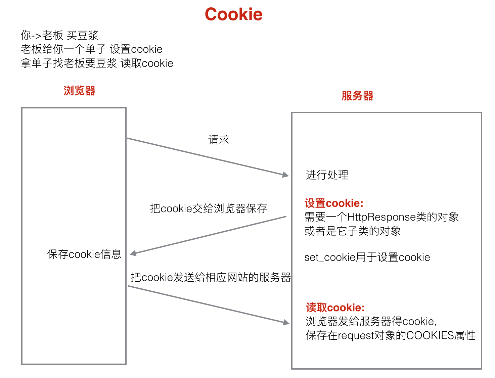

### 状态保持

&emsp;http协议是无状态的。下一次去访问一个页面时并不知道上一次对这个页面做了什么 ,在HTML页面中有两种方式可以记住访问的状态**Cookie**和**Session**

#### Cookie

<font color=red>cookie是由服务器生成，存储在浏览器端</font>的一小段文本信息。

cookie的特点：

1. 以键值对方式进行存储。

2. 通过浏览器访问一个网站时，会将浏览器存储的跟网站相关的所有cookie信息发送给该网站的服务器。request.COOKIES

3. cookie是基于域名安全的。

4. cookie是有过期时间的，如果不指定，默认关闭浏览器之后cookie就会过期。



HttpResponse的子类：<font color=red>HttpResponseRedirect，JsonResponse</font>

* 所有的Cookie的值在后台取出来都是<font color=red>字符串</font>

* 设置方法：

```python
# /set_cookie
def set_cookie(request):
    '''设置cookie信息'''
    response = HttpResponse('设置cookie')
    # 设置一个cookie信息,名字为num, 值为1
    response.set_cookie('num', 1, max_age=14*24*3600)
    # response.set_cookie('num2', 2)
    # response.set_cookie('num', 1, expires=datetime.now()+timedelta(days=14))
    # 返回response
    return response

# /get_cookie
def get_cookie(request):
    '''获取cookie的信息'''
    # 取出cookie num的值
    num = request.COOKIES['num']
    return HttpResponse(num)
```

* 记住用户名案例：

```python
def login_check(request):
    '''登录校验视图'''
    # request.POST 保存的是post方式提交的参数 QueryDict
    # request.GET 保存是get方式提交的参数
    print(request.method)
    # 1.获取提交的用户名和密码
    username = request.POST.get('username')
    password = request.POST.get('password')
    remember = request.POST.get('remember')
    # 2.进行登录的校验
    # 实际开发:根据用户名和密码查找数据库
    # 模拟: smart 123
    if username == 'smart' and password == '123':
        # 用户名密码正确，跳转到首页
        response = redirect('/index')

        # 判断是否需要记住用户名
        if remember == 'on':
            # 设置cookie username，过期时间1周
            response.set_cookie('username', username, max_age=7*24*3600)

        # 返回应答
        return response
    else:
        # 用户名或密码错误，跳转到登录页面
        return redirect('/login')
    
def login(request):
    '''显示登录页面'''
    # 判断用户是否登录
    if request.session.has_key('islogin'):
        # 用户已登录, 跳转到首页
        return redirect('/index')
    else:
        # 用户未登录
        # 获取cookie username
        if 'username' in request.COOKIES:
            # 获取记住的用户名
            username = request.COOKIES['username']
        else:
            username = ''

        return render(request, 'booktest/login.html', {'username':username})
```

#### Session

* Session存储在<font color=red>服务器端</font>
* Session的特点：

1. session是以<font color=red>键值对</font>进行存储的。
2. session依赖于cookie。唯一的标识码保存在sessionid cookie中。
3. session也是有过期时间，如果不指定，默认两周就会过期。


```python
# /set_session
def set_session(request):
    '''设置session'''
    request.session['username'] = 'smart'
    request.session['age'] = 18
    # request.session.set_expiry(5)
    return HttpResponse('设置session')


# /get_session
def get_session(request):
    '''获取session'''
    username = request.session['username']
    age = request.session['age']
    return HttpResponse(username+':'+str(age))
```

* 与Cookie不同，设置的Session是什么数据类型，取出来的就是什么数据类型；设置的是字符串，取出来就是字符串，设置是数值，取出来就是数值；
* Session默认启动

 打开test3/settings.py文件，在项MIDDLEWARE_CLASSES中启用Session中间件 

```python
MIDDLEWARE_CLASSES = (
'django.contrib.sessions.middleware.SessionMiddleware', # 启用Session中间件，如果要禁用，需要注释本行代码
    'django.middleware.common.CommonMiddleware',
    # 'django.middleware.csrf.CsrfViewMiddleware',
    'django.contrib.auth.middleware.AuthenticationMiddleware',
    'django.contrib.auth.middleware.SessionAuthenticationMiddleware',
    'django.contrib.messages.middleware.MessageMiddleware',
    'django.middleware.clickjacking.XFrameOptionsMiddleware',
    'django.middleware.security.SecurityMiddleware',
)
```

 **禁用Session：**将Session中间件删除。 

* 存储方式

 打开test3/settings.py文件，设置SESSION_ENGINE项指定Session数据存储的方式，可以存储在数据库、缓存、Redis等 

1. 存储在数据库中，如下设置可以写，也可以不写，这是默认存储方式。

```python
SESSION_ENGINE='django.contrib.sessions.backends.db'
```

2. 存储在缓存中：存储在本机内存中，如果丢失则不能找回，比数据库的方式读写更快。

```python
SESSION_ENGINE='django.contrib.sessions.backends.cache'
```

3. 混合存储：优先从本机内存中存取，如果没有则从数据库中存取。

```python
SESSION_ENGINE='django.contrib.sessions.backends.cached_db'
```

4.  如果存储在数据库中，需要在项INSTALLED_APPS中安装Session应用 

```python
INSTALLED_APPS = (
    'django.contrib.admin',
    'django.contrib.auth',
    'django.contrib.contenttypes',
    'django.contrib.sessions', # 安装Session应用
    'django.contrib.messages',
    'django.contrib.staticfiles',
    'bo
```

5.  迁移后会在数据库中创建出存储Session的表 ；

* 对象及方法

 通过HttpRequest对象的session属性进行会话的读写操作 

1.  以键值对的格式写session。

```python
request.session['键']=值
```

2. 根据键读取值。

```python
request.session.get('键',默认值)
```

3. 清除所有session，在存储中删除值部分。

```python
request.session.clear()
```

4. 清除session数据，在存储中删除session的整条数据。

```python
request.session.flush()
```

5. 删除session中的指定键及值，在存储中只删除某个键及对应的值。

```python
del request.session['键']
```

6. 设置会话的超时时间，如果没有指定过期时间则两个星期后过期。

```python
request.session.set_expiry(value)
# 如果value是一个整数，会话将在value秒没有活动后过期。
# 如果value为0，那么用户会话的Cookie将在用户的浏览器关闭时过期。
# 如果value为None，那么会话永不过期。
```

* **案例：记录用户登录状态**

```python
def login_check(request):
    '''登录校验视图'''
    # request.POST 保存的是post方式提交的参数 QueryDict
    # request.GET 保存是get方式提交的参数
    print(request.method)
    # 1.获取提交的用户名和密码
    username = request.POST.get('username')
    password = request.POST.get('password')
    remember = request.POST.get('remember')
    # 2.进行登录的校验
    # 实际开发:根据用户名和密码查找数据库
    # 模拟: smart 123
    if username == 'smart' and password == '123':
        # 用户名密码正确，跳转到首页
        response = redirect('/index')

        # 判断是否需要记住用户名
        if remember == 'on':
            # 设置cookie username，过期时间1周
            response.set_cookie('username', username, max_age=7*24*3600)
            
        # 记住用户登录状态
        # 只有session中有islogin,就认为用户已登录
        request.session['islogin'] = True
            
        # 返回应答
        return response
    else:
        # 用户名或密码错误，跳转到登录页面
        return redirect('/login')
    
def login(request):
    '''显示登录页面'''
    # 判断用户是否登录
    if request.session.has_key('islogin'):
        # 用户已登录, 跳转到首页
        return redirect('/index')
    else:
        # 用户未登录
        # 获取cookie username
        if 'username' in request.COOKIES:
            # 获取记住的用户名
            username = request.COOKIES['username']
        else:
            username = ''

        return render(request, 'booktest/login.html', {'username':username})
```

#### Cookie和Session的应用场景

* cookie：记住用户名，安全性要求不高
* session：涉及安全性安全要求较高的数据，银行卡账号，密码；