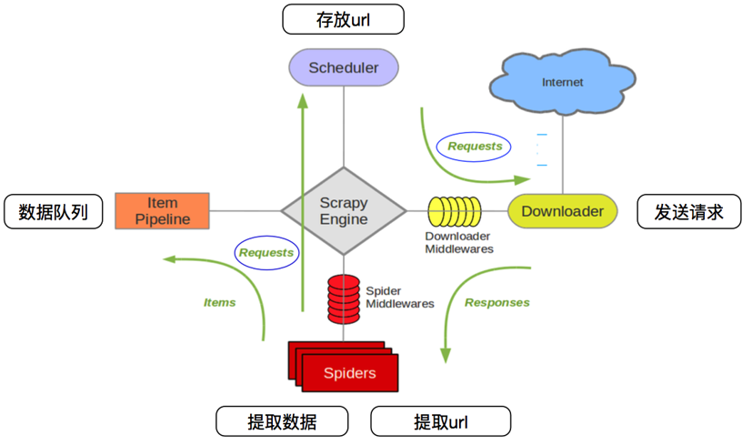
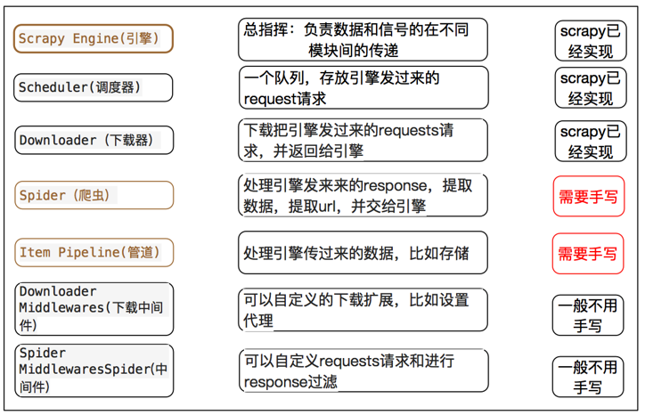
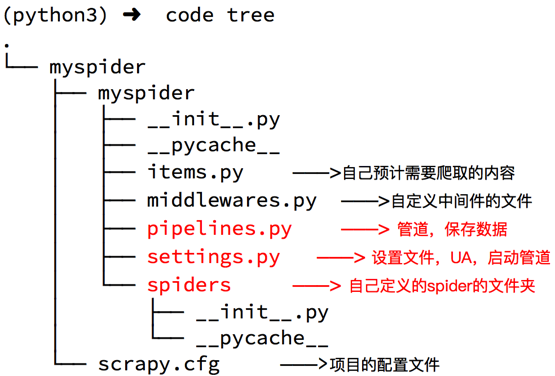
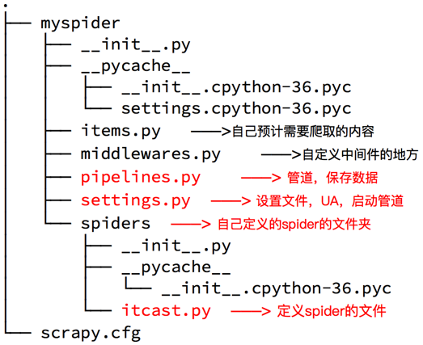
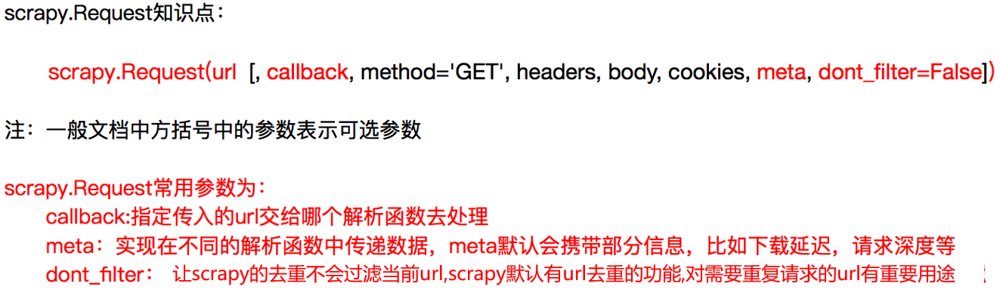
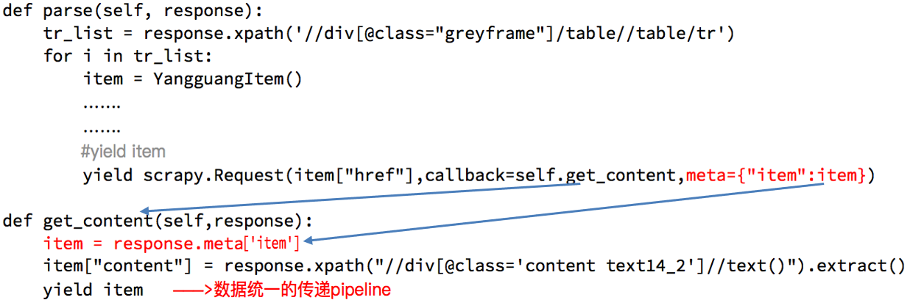
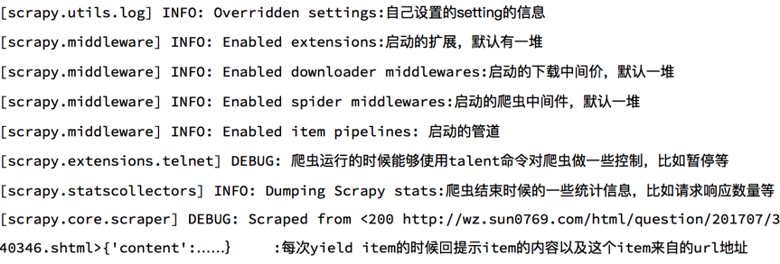

# Srapy框架

&emsp;Scrapy是一个为了爬取网站数据，提取结构性数据而编写的应用框架，我们只需要实现少量的代码，就能快速抓取

&emsp;Scrapy使用了Twisted异步网络框架，可以加快下载速度

- Scrapy运行流程



- Scrapy框架模块功能详情




## 安装scrapy

- `pip install scrapy`

## Scrapy入门

- 创建一个scrapy项目
  - `scrapy startproject mySpider`
  - 
- 生成一个爬虫
  - `scrapy genspider itcast"itcast.cn"` itcast是爬虫名， "itcast.cn"是限制爬虫爬取的范围
  - 
- 提取数据

  - 完善spider，使用xpath等方法

- 保存数据

  - pipeline中保存数据
- 爬虫的启动

  - 爬虫启动的位置
    - 在项目位置启动spider
  - 如何启动
    - `scrapy crawl itcast`
    - 

## Scrapy使用提高

### pipeline

可以定义多个pipeline，多个pipeline的作用如下：

- 可能会有多个spider，不同的pipeline处理不同的item的数据
- 一个spider的内容可能要做不同的操作，比如存入不同的数据库中
- 注意
  1. pipeline的权重越小，优先级越高
  2. pipeline中process_item方法名不能修改为其他名称

### LOG的设置

- 为了让输出到终端的内容能容易看一些：

- 需要在setting中设置log级别,（终端默认是debug级别）
  - 在setting中添加一行（全部大写）
  - `LOG_LEVEL = "WARNING”`

- 同时，也可以在项目文件中，使用logging模块在日志中记录想要的东西

```python
import logging
def process_item(self, item, spider):
    logging.warning(item)
    
# 终端输出效果
# 2020-07-27 10:47:07 [root] WARNING:{"name":"xiaohong"}
# 这种方法不能记录log的位置
```

- 也可以使用logger对象来记录log

```python
import logging
logger = logging.getLogger(__name__)

def process_item(self, item, spider):
    logger.warning(item)
    
# 终端输出效果
# 2020-07-27 10:47:20 [myspider.pipelines] WARNING:{"name":"xiaohong"}
# 这种方法可以记录log的位置
```

- 也可以在setting中设置log保存位置，而不是直接输出在终端中
  - `LOG_FILE = "./log.log"`

### scrapy实现翻页

- 实现翻页爬取，需要将下一页的url地址通过`scrapy.Requeset`传递给需要执行的函数

```python
    def parse(self, response):
        spider_data = json.loads(response.body)["Data"]["Posts"]
        for i in spider_data:
            item = {}
            item["职位"] = i["RecruitPostName"]
            item["工作地"] = i["LocationName"]
            item["发布时间"] = i["LastUpdateTime"]
            yield item
        if self.page_insex * 50 <= json.loads(response.body)["Data"]["Count"]:
            print(json.loads(response.body)["Data"]["Count"])
            self.page_insex+= 1
            next_url = 'https://careers.tencent.com/tencentcareer/api/post/Query?pageIndex={}&pageSize=50'.format(self.page_insex)
            yield scrapy.Request(
                next_url,
                callback=self.parse
            )
```

- 爬取详情页也是同样的操作
- 

### item的使用

- 可以在item中定义需要爬取的信息

```python
class TencetItem(scrapy.Item):
    # define the fields for your item here like:
    title = scrapy.Field()
    publish_date = scrapy.Field()
    word_place = scrapy.Field()
```

- 然后在spider与pipelines中使用item需要导入，并实例化
  - `from tencent.items import TencentItem`
  - `item = TencentItem()`
  - 注意，在pipelines中保存数据的时候要特别注意item不是字典，只是类似字典，所以需要进行强制类型转换`item = dict(item)`

### 在不同的解析函数中传递函数



### debug的使用

- 调试信息中可以查看程序运行的相信情况，要是吧`LOG_LEVEL`设置为`WARNING`的时候程序运行是不会显示警告以下的信息的
- debug信息对应内容如下：



### scrapy shell交互终端的使用

- Scrapy shell是一个交互终端，我们可以在未启动spider的情况下尝试及调试代码，也可以用来测试XPath表达式

- 使用方法：

  - `scrapy shell url地址`
  - response.url：当前响应的url地址
  - response.request.url：当前响应对应的请求的url地址
  - response.headers：响应头
  - response.body：响应体，也就是html代码，默认是byte类型
  - response.requests.headers：当前响应的请求头
### setting的使用
- 配置文件存放一些公共的变量（比如数据库的地址，账号密码等）方便自己和别人修改
  
  - 一般用全大写字母命名变量名 `SQL_HOST = '127.0.0.1'`
  
##  crawlspider

-  作用：
  - 自动从response中提取所有的a标签对应的地址，自动构造自己的requests请求，发送给引擎
  - 可以自动实现访问详情页或者下一页等
  
- 使用方法：
  
  -  生成crawlspider的命令：
    - `scrapy genspider –t crawl csdn “csdn.cn”`
  


- 注意点：
  - crawlspider中不能再有parse为名字的数据提取方法，这个方法被crawlspider用来实现基础url提取等功能。
  - 一个Rule对象接收很多参数，首先第一个是包含url规则的LinkExtractor对象，常用的还有callback和follow
  - 不指定callback函数的请求下，如果follow为True，满足该Rule的url还会继续被请求
  - 如果多个Rule都满足某一个url，会总Rule中选择第一个满足的进行操作

- Rules补充
  
  - `link_extractor`：是一个Link Extractor对象，用于定义需要提取的链接。
  
  - `callback`： 从link_extractor中每获取到链接时，参数所指定的值作为回调函数，该回调函数接受一个response作为其第一个参数。
  
    > 注意：当编写爬虫规则时，避免使用parse作为回调函数。由于CrawlSpider使用parse方法来实现其逻辑，如果覆盖了 parse方法，crawl spider将会运行失败。
  
  - `follow`：是一个布尔(boolean)值，指定了根据该规则从response提取的链接是否需要跟进。 如果callback为None，follow 默认设置为True ，否则默认为False。
  
  - `process_links`：指定该spider中哪个的函数将会被调用，从link_extractor中获取到链接列表时将会调用该函数。该方法主要用来过滤。
  
  - `process_request`：指定该spider中哪个的函数将会被调用， 该规则提取到每个request时都会调用该函数。 (用来过滤request)
  
- crawlspider 连接提取器补充
  
  - `allow`：满足括号中“正则表达式”的URL会被提取，如果为空，则全部匹配。
  - `deny`：满足括号中“正则表达式”的URL一定不提取（优先级高于allow）。
  - `allow_domains`：会被提取的链接的domains。
  - `deny_domains`：一定不会被提取链接的domains。
  - `restrict_xpaths`：使用xpath表达式，和allow共同作用过滤链接。

## scrapy模拟登陆

- 直接携带cookie

  - cookie过期时间长、常见于一些不规范的网站

  - cookie过期之前可能拿到所有数据

  - 配合其他程序使用，比如使用selenium把登陆后的cookie

  - 在爬虫中重新顶一个`start_requests`方法，覆盖掉父类的方法，在`start_requests` 中携带cookies承诺书

  - ```python
        def start_requests(self):
            cookies = "anonymid=jcokuqturos8ql; depovince=GW; jebecookies=f90c9e96-78d7-4f74-b1c8-b6448492995b|||||; _r01_=1; JSESSIONID=abcx4tkKLbB1-hVwvcyew; ick_login=ff436c18-ec61-4d65-8c56-a7962af397f4; _de=BF09EE3A28DED52E6B65F6A4705D973F1383380866D39FF5; p=90dea4bfc79ef80402417810c0de60989; first_login_flag=1; ln_uact=mr_mao_hacker@163.com; ln_hurl=http://hdn.xnimg.cn/photos/hdn421/20171230/1635/main_JQzq_ae7b0000a8791986.jpg; t=24ee96e2e2301bf2c350d7102956540a9; societyguester=24ee96e2e2301bf2c350d7102956540a9; id=327550029; xnsid=e7f66e0b; loginfrom=syshome; ch_id=10016"
            cookies = {i.split("=")[0]:i.split("=")[1] for i in cookies.split("; ")}
            # headers = {"Cookie":cookies}
            yield scrapy.Request(
                self.start_urls[0],
                callback=self.parse,
                cookies=cookies
                # headers = headers
            )
    ```

  - 

- 使用FormRequest请求

  - 方法1，寻找post地址，并将post

  - ```python
    def parse(self, response):
            authenticity_token = response.xpath("//input[@name='authenticity_token']/@value").extract_first()
            timestamp = response.xpath("//input[@name='timestamp']/@value").extract_first()
            timestamp_secret = response.xpath("//input[@name='timestamp_secret']/@value").extract_first()
            post_data = {
            "authenticity_token": authenticity_token,
            "ga_id": "",
            "login": "15308255956@163.com",
            "password": "Yy310526.",
            "webauthn - support": "unknown",
            "webauthn - iuvpaa - support": "unknown",
            "return_to": "/join",
            "required_field_8fb5": "",
            "timestamp": timestamp,
            "timestamp_secret": timestamp_secret
            }
            yield scrapy.FormRequest(
                "https://github.com/session",
                formdata=post_data,
                callback=self.after_login
            )
    ```

  - 方法2，使用FormRequest.from_response，这种方法只用准备用户名和密码就可以了

  - ```python
    def parse(self, response):
            yield scrapy.FormRequest.from_response(
                response,
                formdata={"login": "15308255956@163.com", "password": "Yy310526."},
                callback=self.after_login
            )
    ```

## 中间件

### 下载中间件

- 使用方法：
  
- 编写一个Downloader Middlewares和我们编写一个pipeline一样，定义一个类，然后在setting中开启
  
- Downloader Middlewares默认的方法：
  - process_request(self, request, spider)：当每个request通过下载中间件时，该方法被调用。

  - process_response(self, request, response, spider)：当下载器完成http请求，传递响应给引擎的时候调用

  

  


## scrapy_redis

- 作用：在scrapy的基础上实现了更多，更强大的功能，具体表现在：request去重，爬虫持久化和轻松实现分布式
- Scrapy_redis的工作流程


- scrapy_redis 的使用
  
  - demo的spider
  
  
  
  - demo的setting


  - scrapy_redis的实现方式

      - redispipeline 中实现数据保存

    

      - RFPDupeFilter中实现过滤请求

    

      - scheduler实现持久化与判断是否进入队列

     


